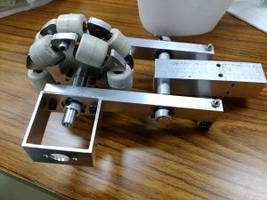

こんにちは、きゅうり巻きです！

 

気が付けばロボコン本番から一ヶ月が過ぎ、本放送まで一週間前となりました。時間の流れは早い物ですね。

 

さて、今回の記事ですが、本番では使われなかったハンドスピナー自作オムニを紹介したいと思います！

上の写真が自作したオムニホイールです。これは接地エンコーダーという、どれくらい動いたかを計測するセンサーを使うために作ったオムニホイールです。市販のオムニホイールでは、グリップ力が弱く滑りやすい難点があったため、グリップ力の強い白色ローラーを用いたものです。（できるだけ小さくなるよう努力しましたが、直径90mmほどあります。）白色ローターは個々でしか販売されていないため、ローラー同士をつなぐボディ部分をNCフライスで削ったものです。

 

なお、足回りの制御で接地エンコーダー無しでも十分に自己位置が出せること、また重量制限の関係で実際の機体には取り付けませんでした……。悲しいです。

 

現在は何か手持無沙汰な人がいれば、このオムニホイールをぐるぐる回すハンドスピナーとして活躍しておりますが、いつの日か実際のロボットに取り付けられればなぁ、と思っております。

 

それでは、今日はここで。失礼します。
