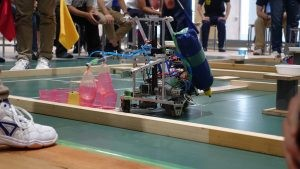
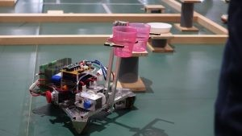
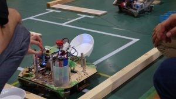
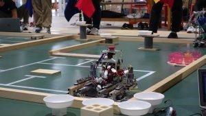

こんにちは、ハンスです。

ForteFibreの夏は今年も大忙し！！ 数々の大会に他校との交流会！夏休みってなんだろう！？ さて、そんなForteFibreの夏の陣、第一弾ということで

今日（もとい昨日）はNHK学生ロボコンでも屈指の強豪校、金沢工業大学に１年生の新人戦のためにやって来ました。 今回の大会、SummerRobotContest、略してSRCは金沢工業大学の部内戦をルーツに持つ新入生のための大会です。 最近は参加チーム数も増えて少しずつ大きな大会になりつつあると言えるでしょう。

さて、ForteFibreから出場したのは「ほろよい」、「STRONG ZERO」の2チーム！ 去年は3チーム出場したのですが、今年は1年生のハード班が4人しかいないこともあって1チーム減りました。

ハード班は1チームそれぞれ1年生2人に高専ロボコンも経験したという3年次編入の人をそれぞれ加えて1チーム3人、 ソフト班は新入生がなんと10人もいたので第一回新人戦（ライントレース）で選びぬかれたそれぞれ2人を合わせた5人1チームで挑みました。

気になる結果は7チーム中「ほろよい」「STRONG ZERO」がそれぞれ4,5位でした！

惜しくも金沢工業大学に敗れてしまい、1〜3位の独占を許してしまいました。 しかし、彼らはまだまだ前途ある新人ロボコニスト！この悔しさを糧にこれからもロボコニストとして成長することを期待しています。 1年生にとっては6月のNHK学生ロボコンが終わって始まってから3ヶ月ちょっと、初めてのロボコンらしいロボコンでした。 特に直前などは追い込みでかなりしんどい場面もあったと思いますがそれでも死んだ目のその奥に熱い心があったからこそ乗り越えられたのでしょう。 みんなもうすっかりロボコンの魅力に取り憑かれてしまっているようで何よりです。

上回生の間では今年のSRCルールは去年のルールよりも難しく、更に大会が1ヶ月も早いのでどうなることかと囁き合っていましたが無事（？）大会を迎えることができました。 （いや、やっぱりどの大学も自動機苦戦してたし大会ちょっと早かったよね...Vゴール見たかったなぁ）

まだまだ書きたいことはあるのですが、今日は大会で疲れて眠たいのでここまでにしておきます。

細かい機構の話は実はもう一人いるブログ更新係ちゃんに書いてもらう予定です。

それでは！

