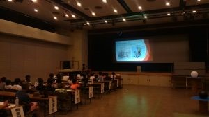
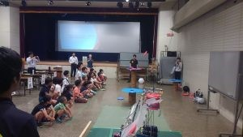
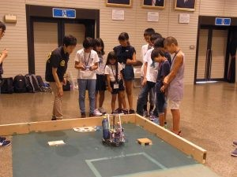
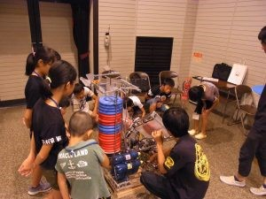

こんばんは、ハンスです。

今回は少し前のこととなりますが、去る8月24日に「綾部ものづくり体験ツアー」に参加してきました。

開催された地、綾部市はロボコニスト御用達のエンコーダーを作る会社があったりと工業化を市が強力に推し進めている都市です。

「綾部ものづくり体験ツアー」とはそんな綾部市と京都工芸繊維大学が手を組んで、

日本の将来を担う若い世代（小学生）に向けて開催しているイベントです。

 

前日に現地入りして設営した後に一泊したあと、朝早くからのイベントでしたが、

9時の集合に対して10分前にはたくさんの小学生が既に来ている状態で

横にあるロボットを見ながらそわそわしている様子でした。

 

まず、京都工芸繊維大学のロボティクス研究室の助教であり、我がプロジェクトの顧問でもある東先生からロボットに関する授業、

本プロジェクトのリーダーによるロボコン授業がありました。  そのあと、実際に現地まで持って行ったNHK学生ロボコン2017の出場ロボットを始めとするロボット達の実演や操縦体験を行ってもらいました。

小学生達は目を輝かせながらロボットに見入ったり操縦したりしていました。

 

私達のロボットが小学生への良い刺激になっていれば嬉しいな、と思います。

（そしてForteFibreに入ってくれることを期待しています笑）
