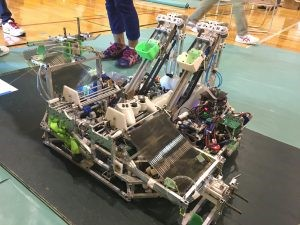
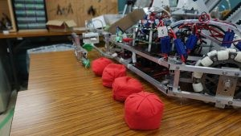
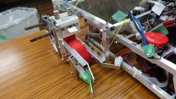
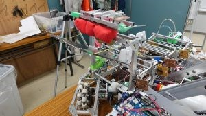
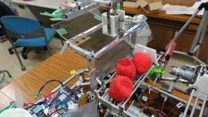
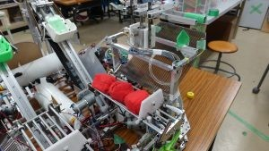
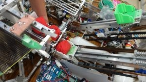

こんばんは、ハンスです。

9/2に愛知県の豊橋技術科学大学で開かれた東海地区ロボコン、通称とうロボに参加してきました。

とうロボは東海地区のNHK学生ロボコン出場校を中心に日本のロボコンのレベルアップを目的とした大会で、

東海地区ではありませんが私達も京都の地から昨年より参加させて頂いています。

 

ルールは競技フィールド内に置かれた7つのカゴにお手玉を入れてカゴを奪い合い、

奪ったカゴが多いほうが勝ち、と言うものです。

 

私達も30秒以内のVゴールを目標にロボットを製作していたのですが、スケジュールの遅れが続発してしまい、

なんとかロボットは出来上がったものの制御のための時間が全くと言っていいほどなく、

最終的には足回りのモーターのゲイン調整も満足にできないままの出場となってしまいました。

そして、最終的に0勝2敗で予選敗退に終わってしまいました。

 

大会ではちゃんとした動きを見せられなかったのですが、

それではせっかく作ったロボットも浮かばれないと思うのでここで紹介しておきます。

（いや、格好いいロボットだしむしろみんな見て！！）

 

まず、ロボット全体の写真です。

機体のかっこよさは私達の自負するところでもあります。

それだけにちゃんと動かしてあげれなかったのが心残りです。

 

このロボットの競技時の流れは

まず、地面に置かれたお手玉を走りながら機体の横にあるハンドで取得します。

続いて、お手玉を掴んだ状態でハンドを持ち上げ、

機体の中央にある供給機構へお手玉を持ってきます。

この時、下の写真にうつっている焦げ茶色の板がガイドの役割を果たし、

お手玉を供給機構へ誘導します。

次に、供給機構の白い板でお手玉をお手玉の発射機構へ押し出します。

発射機構は定荷重バネと呼ばれる板バネの一種が動力となっており、

モーターで引き絞ってエアーの力でそれを一気に開放することでお手玉を飛ばします。

 

これを繰り返しVゴールを狙う、というコンセプトのロボットでした。

 

さて、結果が伴わなかったとは言え、今回のとうロボからはたくさんのことを学ぶことができ、出場した事自体への後悔は全くありません。

初めて20kg級のロボットの設計や長期に渡るチームマネジメント...

NHK学生ロボコンを前に良い薬になったと思っています。

 

また、とうロボに参加した各大学は既にNHK学生ロボコン2018に向けて動き始めていると思います。

私達もとうロボでの敗戦やここで得たものを糧にこれからも頑張っていきたいと思います。
