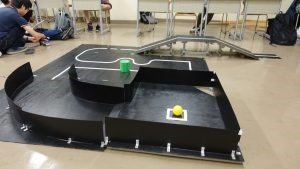
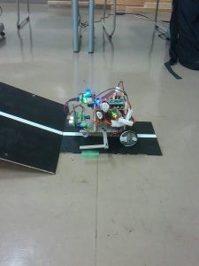
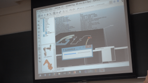

こんにちは、ハンスです。

9/5にレスキューロボコンを模した部内大会が開催されました。

 

毎年なら新入生は全員第二回新人戦としてSRC(詳細は[8/21のエントリー](2017-08-20)をご覧ください)に出場するのですが、

今年はハード班6人(うち編入生2人)、ソフト班10人というハード・ソフト比もあって、

SRCにソフト班が全員出場できませんでした。

 

そこでSRCの代わりとして、新入生のソフト班に出てもらう大会として用意したのが今回の大会、部内レスキューロボコン大会です。

今回の大会は第一回新人戦のライントレースからはレベルアップして、ラインには途切れや直角カーブ、

坂があったりラインの上に障害物がおいてあったり、はたまたラインが存在しないところ（壁を読んでトレースします）があったりと難しくなっています。

また、部門を新人の部・老害の部を用意して上回生も出ることのできるようにしました。

 

まず、行われたのは新人の部です。

最初はエントリーした人が数人いたのですが、大会が近づくに連れて一人また一人とリタイアするひとが増えて、大会当日には1人となってしまいました。

部門優勝は大会が始まる前から決まっていましたが、見事に44秒で被災者救助を達成し優勝にふさわしい素晴らしい走りを見せてくれました。

 

次は老害の部です。

老害の部にエントリーしたのは3年生のハード・ソフト班からそれぞれ2人ずつの4人です。

一人目のソフト班は新人の部のタイムを上回る36秒のVゴール最速タイムを叩き出し、先輩の意地を見せてくれました。

しかし、他の出場者は1、２日前に実機が出来上がったなどで調整が間に合っておらず、ライントレースくらいはできるものの、

Vゴール達成には至りませんでした。

 

そこで突如現れたのが、実機の調整が終わっていないと言うもののシミュレーションの上では「もう完璧✨」という老害その3です。

ハード班でありながらシミュレーション上でセンサまで再現してプログラムを動作させており、

大会運営は急遽部門「シミュレーションの部」を作る等の対応に追われました。（もちろん一人なので部門優勝確定です笑）

 

結果的に部門が一つ増えるなどというアクシデントもありましたが、とても有意義な大会だったと思います。

特に1回生の出場者は先輩のタイムには及ばなかったものの、

そしてこの人、なんと大会一週間前からVゴールが可能なレベルに達しており、

残りの時間を動作の最適化、ソースコードのブラッシュアップに費やすなど大会に向けてしっかりとしたスケジューリングや

Vゴールを達成しても毎日部室に来て調整するなどそこで終わらない向上心を見ることができました。

今後が楽しみです！

 

さて、明日は京都製作所様主催の[キャチロボバトルコンテスト](http://catchrobo.net/)です！

私達も運営校の一つとして、部員の何人かが運営スタッフとして今日も前日テストランの手伝いに行ってくれています。

なんでも今回は過去最大級規模の大会になるとか...

楽しみですね！

 

それではまた、キャチロボの記事をお楽しみに！
