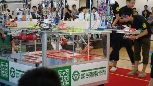

こんばんは、ハンスです。

 

今日は京都製作所主催のキャチロボバトルコンテストに行ってきました。

キャチロボバトルコンテストとは、フィールド上に置かれている毎年決められたお菓子などのワーク（今年は森永マリー）

を拾い集めて規定の位置に詰め込む、という産業系ロボットのコンテストです。

私達京都工芸繊維大学ROBOCON挑戦プロジェクトにとっては7年前の第一回大会から出場したり運営のお手伝いをさせていただいたりなどと

なにかと縁のある大会で現在ではキャチロボ実行委員会の参加校の一つとして部員の一部が運営スタッフとして参加させていただいています。

さて、今年の大会は全国から30数チームのエントリーがあり、過去最大規模の大会となりましたが、

私達京都工芸繊維大学のチーム、「くまさんチーム」は予選では21点を決めて同率5位とまずまずの滑り出しをみせました。

予選第一回戦は不調ながらも相手の長岡技術科学大学「N.U.T.FORCE」さんに8:10で辛勝したものの、

次の準々決勝であたったのが信州大学「アルプスの乙女りんごさん」。

この大学、最終的にベスト4で終わってしまったのですが実に大会2位のスコアを叩き出す実力校で

そんな信州大学の前に36:17で敗退してしまいました。

 

そして、最終的な結果はベスト8でした。

（そろそろ、ベスト16やベスト8以外の成績も取って行きたいものですね笑）

 

試合では操縦者2人の連携ミスやマリー取得の際のミスも目立ちましたが、

その後の試合を見ていてもやはり上位チームは安定していて練習量の違いを見せつけられました。

やはり私達にとって練習量は永遠のテーマです（APPAREは別）。

 

さて、ようやく大会ラッシュも終わりが見え始め、ForteFibre夏の陣も残すは交流会数個となりました。

NHK学生ロボコンに向けても動き始めなくてはいけないので引き続き気を抜かず頑張っていきたいと思います。

 

それでは
