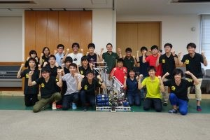

こんばんは、ハンスです。

またこいつかよ、と思うかもしれませんが今回もお付き合いください。

 

さて、今日はうちの大学に東京大学RoboTechさんから6人がいらっしゃって交流会を行いました。

 

まずは、行きたいと言う方がおられたので大学にKITShopと呼ばれる学内コンビニがあるのでそちらを見学してもらいました。

建物の外装や購買の書籍部等が綺麗だと言っておられました。

因みに1階にある食堂オルタスに行ってカレーを食べた方もいたのですが東大の食堂のカレーより美味しいとの評価をいただきました笑

（ここまでは流石に予定外です笑）

 

さて、ここから交流会にはいりまして、

初めに自分たちがどういう言うことをしているかを知っていただくためのプレゼンをプロジェクトリーダーの方から行い、

その後に部室見学を行いました。

部室にはとうロボやキャチロボ、NHK2017の試作機構（の残骸）を展示しておいたのでそれらを中心に話が弾みました。

とりわけ、とうロボの機体やNHK2015で日の目を見ることがなかった精巧な足回り機構（技官さん作）を周りを取り囲んで注意深く見ておられました

 

次に場所を変えて、NHK学生ロボコン2017に出場した機体を場所を移動して見てもらいました。

まず、5分間のテストランでもう完璧✨なパラメータをとったのちにNHK2017一連デモを行いました。

NHK2017のロボットを動かすのは久々でしたがAPPARE(1:10)を無事決めることができました。

 

デモのあとはロボットの機構紹介を軽くして、そのあとはロボットを囲んで雑談していましたが

同じロボコンをするもの同士話のネタは尽きず、解散になったのは終了予定時刻の1時間以上も立っていました笑

 

以下は解散の前にとった集合写真です。

（みんなで勝ちました！）

 

 

いらっしゃったRoboTechの皆さん、ありがとうございました。

おかげでとても楽しいひとときになりました。

 

それではまた次の記事で！
