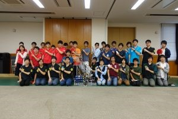
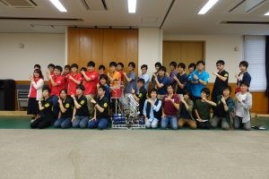
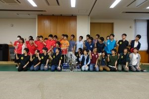

こんばんは、今日もハンスです。

 

今日は金沢工業大学さん、名古屋工業大学さんと交流会を行いました。

今日も例の如くそれぞれの大学がプレゼンを行いました。

 

その後、部室見学を行いましたが、今日は先日の東京大学さんの時とは違って人数が多かったので

それぞれの大学で別々になって部室見学を行いました。

 

その次はNHK2017のデモを行ったのですがなんとここで自分たちもびっくりの最速の49sAPPAREが飛び出しました！

その後、機体紹介やLRF自己位置デモ、無限に雑談をしたあと、

最後にそれぞれの大学のポーズで集合写真をとって解散しました。

 

名古屋工業大学のPVのポーズ

 

金沢工業大学の決めポーズ

 

京都工芸繊維大学のもう完璧✨のポーズ
