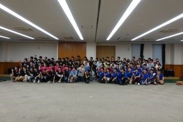

こんばんは、ハンスです。

 

今日は近畿合同交流会がありました。

そろそろ他大の方で交流会がしたいです...

(ホスト校は準備や設営が連日続くとしんどいものがあるのです)

 

さて、今日は

大阪大学

大阪府立大学

大阪工業大学

京都工芸繊維大学

同志社大学

三重大学

立命館大学

の近畿7大学で合同交流会を行いました。

 

総勢100名近くでの交流会だったので全員入る部屋が限られていたり、

部室ツアーを数グループに分かれて行ったり準備の方も大変でした。

 

参加大学が多いのでプレゼンも10:30から始めて、

最後の大学が終わった時には14:30になっていました。

 

その後は4班くらいに別れてもらって部室見学ツアー&NHK2017デモをしました。

今日は昨日とは違って少し調子が悪かったようでAPPAREタイムは1:06と1:32でした。

 

その後は自由に懇親会ということでロボット囲んで雑談をしていましたが、

やはり人数がここまで多いとそこら中人だらけでした笑

 

最後になりましたが今日来ていただいた方々、ありがとうございました！

近畿圏の学生ロボコンを一緒に盛り上げていきましょう！

