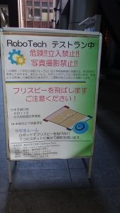
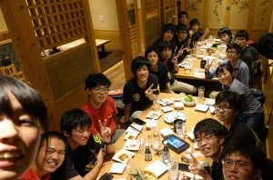

こんばんは、ハンスです。

 

今日は部員13名が東京まで遠征して東京大学RoboTechさんと交流会を行ってきました！

 

交流会は午後からだったので午前はそれぞれの部員が思い思いに東京観光してから東京大学に向かいました。

因みに僕は東京駅から歩いて上野動物園に行ったのですが、楽しいひと時を過ごせました。

 

閑話休題、

有名な東大の赤門を通って学ロボ界隈では有名なSUBWAY前のRoboTechのテストラン会場へ行って

テストランを見学しました。

 

諸事情（）あってAPPAREを見ることはできませんでしたが動いているロボットを見ることができました笑

 

次に、毎年素晴らしいロボットを生み出してくるRoboTechのガレージを見学しました。

ここで写真をあげることはできませんが、興味深いものがたくさんありました。

 

その後、懇親会でもたくさん話を聞くことができました！

（下の写真は集合写真を撮り忘れたのでその時の写真です）

 

これにてForteFibre交流会ラッシュは終了となります。

部員のみんなはたくさんの話をしたり聞いたりすることができたと思うのでこれからのロボコン活動につなげていけるように頑張りたいと思います。

 

それでは！
