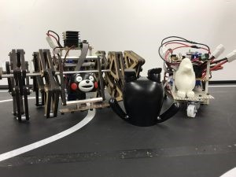

はじめまして、女帝です。（悩んだ末、結局名前思いつかなかったんです）

ブログ書くの初めてです。

 

9/20に立命館大学で開かれた関西合同ロボコンに参加してきました。

この大会は、ライントレースで速さを競う大会で、部門は素人部門、玄人部門の二つに分かれています。

京都工繊からは3回生が1人（ハード班）、1回生が1人（ソフト班）、いずれも素人部門で出場しました。

本来ならばソフト班１回生は全員参加のはずなのですが、SRCの部内大会が9/23に開催される影響を受けて、

だんだんと参加人数が減っていき、最終的には1人になってしまいました。（寂しい）

 

今大会のコースには、R10、たこつぼ、交差点がありました。

私が苦労したのはR10で、それまでのプログラムではどうしても曲がることができなかったので、

本番直前にback制御を入れ、なんとか課題をクリアしました。

3回生の先輩は、コースが去年より長く、ロンリウムが銀色（灰色？）だったので、苦労したとこぼしておられました。

 

大会は参加者がそろわなかったため45分遅れで始まりました。

 

まず行われたのは素人の部です。

 

先輩は「テオ・ヤンセン」で出場されました。

これは有名なテオ・ヤンセン機構を使って設計されたそうです。

本番では、機体のスペック的にスピードをあまり出せず、

大会のルールである3分以内には完走することができませんでしたが、ライントレースは確実にできていました。

 

私は機体名「目・ハンドなし」で出場しました。

この機体は部内レスキューロボコンで使用した時のものから、

超音波センサー（目）とハンド（らしきもの）を取り外した機体だったのでこの名前にしました。

本番前はぎりぎりまでパラメーターの調節をし、速度アップに努めました。

本番は1周約58秒でコースアウトすることなく完走することができました。

 

玄人の部は、やはりレベルが高く、速く走ることを追求した機体もあれば、

レーザー加工をしてデザインに凝っている機体もあり、変わったアイデア（スマホをセンサーとして積んでいたり）を

採用している機体もありました。見ていてとても楽しかったです。

 

結果としては2人とも3位以内には入れませんでしたが、先輩がデザイン賞を獲得し、

はんだセットを手に入れることができました！

 

ちなみに素人部門1位は京都大学の1回生だったのですが、

1周のタイムが玄人部門1位よりも早く、1回生とは思えない走りでした。

 

大会全体としては半分ほどが完走できず、前日までは動いていたのに、

当日動かなくなったと苦い顔をしている方もおられました。

そんな中、多少のトラブルはあったものの2人とも機体は無事に動いて、

ライントレースできていたので良かったと思います。

 

下は左がデザイン賞を獲得した「テオ・ヤンセン」、右が「目・ハンドなし」の写真です。

なお、本番では機体に物は乗っけておりません・・・（振り落とされてしまうので）

