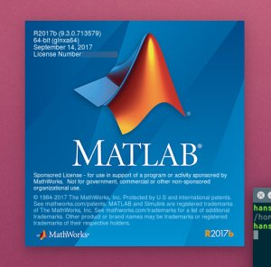

先日、MathWorks様よりご支援をいただき、

あの有名な数値解析ソフトウェアのMATLABを使えるようになりました！

 

ロボコンでは東工大などで使われているとよく聞くMATLABですが、

使いたいと思う人はいても有料であることもあり、自分で買う人はほとんどいませんでした。

（実は既にライセンスを買っている人が1人いた）

 

でも、今回のご支援のおかげで無料で使わせていただけることになり、

優秀なソフトを気軽に使えるようになったことで私達の活動がより活発なものとなることでしょう！

 

さて、せっかくのご支援なので僕も早速インストールしてみました！

18GBくらい容量がもっていかれてSSD256GBのパソコンには

なかなかキツイものがありましたが家に帰って遊んでみようと思います。

まだまだ使い方はわからないですが先人達に聞いてロボコンに有効活用していきたいです。

 

追伸

 

MathWorks様は学生ロボコン関連団体ならご支援していただけるとのことなので

希望する団体様はMathWorks様との仲介をいたしますので下のフォーム、もしくは[kitrobocon@gmail.com](mailto:kitrobocon@gmail.com)までご連絡ください。

\[contact-form\]\[contact-field label="名前" type="name" required="true" /\]\[contact-field label="メールアドレス" type="email" required="true" /\]\[contact-field label="ウェブサイト" type="url" /\]\[contact-field label="メッセージ" type="textarea" /\]\[/contact-form\]
