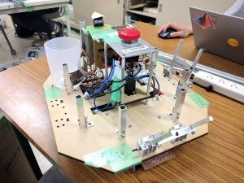

 

はじめまして、ふぁいるです。

 

9/23に部内ロボコンが開催されました。

部内ロボコンのルールは、８月に開催されたSRCのルールを用いました。

なぜSRCのルールを用いたというと、自動機の制御における完成度向上と、手動機操縦者の技術向上を目的として部内ロボコンが開催されたからです。

 

部内ロボコンには、SRC本番と同様、「STRONG ZERO」と「ほろよい」の2チームが出場し、スコアアタック部門と、Vゴールタイムアタック部門の２部門が開催されました。

スコアアタック部門では「STRONG ZERO」が80点で勝利し、Vゴールタイムアタック部門では「STRONG ZERO」が20分42秒を記録しました。

また、急遽エキシビジョンとして、「ほろよい」の手動機と「STRONG ZERO」の自動機でVゴールタイムアタックを行ったところ、5分24秒でVゴールを達成しました。

 

 

ちなみに……僕は、2戦2敗だったチーム「ほろよい」の自動機の制御を担当しました。

部内ロボコン開催の約1時間前には、競技時間内に自動機のタスクを終了させることが可能なレベルへ仕上げていました。

しかし、テストランの最中に、ハンドを動作させているサーボモータが動かなくなってしまい、自動機で得点することが不可能になってしまいました。

悔しいことに、部内ロボコン本番で結果は残せませんでしたが、SRC本番からの約一ヶ月間で、自動機のポテンシャルをさらに引き出すことに成功したと思います。

また、僕は夏休みのほぼすべてを自動機の制御に費やしたのですが、その代わりに多くの経験を得たと思っています。

その経験を、これから参加するロボコン等で活かしていきたいです。

上の機体は、「ほろよい」の自動機です。

(メモ養生、レーシングカーのステッカーみたいでかっこいいと思うんですよね)

 

 

また、部内SRCの様子は、Youtubeにアップロードしてあるので、ぜひご覧ください。

\[youtube https://www.youtube.com/watch?v=DNJUaIbVxFI\]
