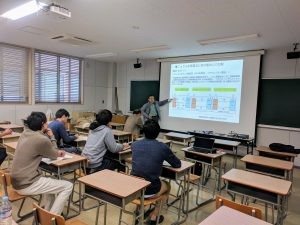

こんにちは、ふぁいるです。

先日、本学にてバッテリー講習会が行われました。

このバッテリー講習会は、京都工芸繊維大学のOB様から、当プロジェクトと交流がしたいというコメントをブログに頂き、実現しました。

この講習会の講師のお二人は、有名ハイブリッド車のバッテリ関連部品の開発をされていた方です。

この講習会では、Lipoの特性や正しい使用方法をはじめとして、当プロジェクトの抱えていた、バッテリー問題の解決法までわかりやすくお教えいただきました。

また、講習会後の交流会では、OB様が開発していた製品の裏話等も伺うことができ、充実した交流会となりました。

この講習会を通して得た知識をこれからの活動に活かしていきます。
