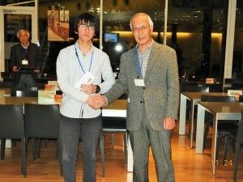

こんばんは、ハンスです。

少し前の出来事となってしまいますが、11月24日の松ヶ崎祭真っ最中に

京都工芸繊維大学同窓会が食堂オルタスにて開催されました。

 

私達ForteFibreはその同窓会へ学内で頑張っている3つの部活・プロジェクトとして

学生フォーミュラチーム「GRANDELFINO」と古美術研究会と共に招待いただき、

なんと支援金までいただいてしまいました！　ありがとうございます！！

 

その後の懇親会でも大学の大先輩方に個別に激励をいただきました。

これからも引き続きいただいた支援金も活用して頑張っていきたいと思います！

