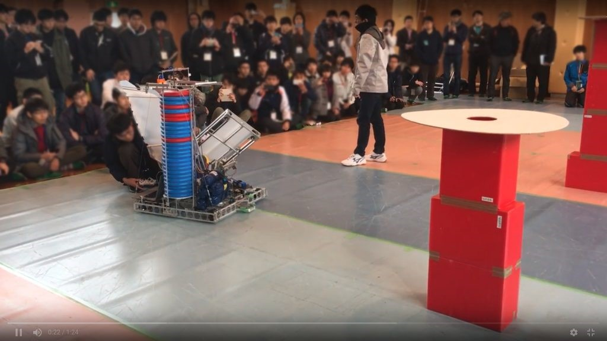

こんにちは！　ふぁいるです！

 

2018年初のブログ更新となります。

昨年は大変お世話になりました。

本年もよろしくお願いします。

 

新年の挨拶はここまでとさせていただいて、今回の話題に移ります。

 

昨年の12月23日、24日に、東北地区ロボコン交流会に参加しました！

東北地区ロボコン交流会（以下東北交流会）は、高専ロボコンOBの方々と仙台高専の方々が主催している、東北地区高専生ロボコニストをメインとした交流会です。

 

東北交流会では、各高専やOB等のプレゼン発表のみならず、機体実演などが行われ、ロボコニストにとって、幸せで濃密な二日間を過ごすことが出来ました。消灯時間以降も、宿泊部屋にロボコニストが集まり、一晩中語らうなどもしました(この時間が一番濃密でした)。

 

また、私達ForteFibreは、学生ロボコン出場にあたっての活動や、NHK2017機体のプレゼン発表、NHK出場機体の実演を行いました。

このような交流会で、100人規模の高専生と交流を行ったのはおそらくForeFIｂre史上初めてだと思われます！

 

主催の方々、交流してくださったロボコニストの方々、本当にありがとうございました！

また機会があれば参加したいと思います！！

 

それではこのあたりで。

