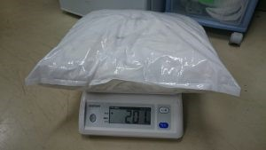

 

こんにちは．プロジェクトリーダー（部長）のもーたーです．

プロジェクトのブログへの投稿は初めてになります．

 

さて，先日株式会社ミスミ様（[HP](http://www.misumi.co.jp/)）より「ミスミ学生ものづくり支援」という企画で5万円分もの商品を無償提供していただきました！

ミスミ様と言えば，機械部品などを扱っていらっしゃる企業で，当プロジェクトもよく機械部品などを購入しています．

 

今回の件で実際にご提供いただいたものが下の写真です．

加工時の保護眼鏡や計測用のレーザー距離計など，様々なものを提供していただきました．（5万円ってすごい…）

 

そんな中でも注目するべきはこれです．

ウェス 2kg！普段部室のウェスが不足しがちなので，これで加工も捗りそうです！

 

それでは，今回はこの辺で失礼します．

今回ご提供いただいたものを有効活用して今後も活動を頑張っていきたいと思います．

 

P.S.

よりプロジェクトのブログを活発にするために，これからは全プロジェクトメンバーが交代でブログを書くことにしました．

なので，みなさんがまだ知らないメンバーに出会えると思います！

これからもブログを楽しみにしていてください！
