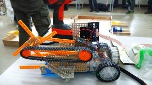
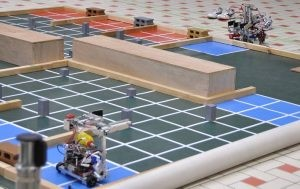
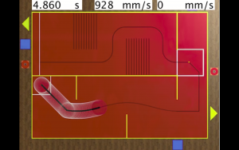

こんにちは。特にあだ名がないためもろバレ、ソフトリーダーの廣部です。

前回のP.S.にも記載されている通り今後はブログも活発にしていこう、ということでさっそく順番が回ってきてしまいました。

おそらく最初で最後のブログ投稿となると思うので、僕のロボコン人生での成長を振り返りつつ未来の後輩への参考になればと思います。

 

入部後、一番最初の大会は第一回新人戦でした。

コントローラーで操作する市販のキットを改造して行う、新入生がものづくりに興味を持つための大会です。

ルールはボールを回収して同じ色の箱に入れるというものでした。

そのときの機体が以下の画像で、細かいところにもいろいろと工夫をしています。ちなみに優勝しました✌

その後も大会に参加したりして

徐々に力をつけていき最終的に、

NHK2017でポールの検出を担当し、機体が目標のポールへ自動で向くような制御もできるようになりました。

◯十万円のセンサーやパソコンを使っています。

(本番で活躍したかはごにょごにょ

(動画は本番の機体ではありません

\[youtube https://www.youtube.com/watch?v=0z9YqmvZES8?rel=0&w=560&h=315\]

３年間(実質2年半)でよく成長できたと思います。

僕は大学に入るまでパソコンを触ったことはありませんでした。

もちろんブラインドタッチなんてできませんでしたし、ファイル名に「◯◯.hirobe」なんて付けたこともあります。

ロボットを触ったことがある・プログラミングをしたことがある、という人は年に1人いるかいないかです。

最近はクラブ内での技術・設備・教育もより充実してきています。

初心者でもやっていけることは上述の通りですので

たくさんの入部、お待ちしております。
