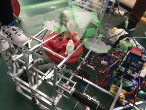
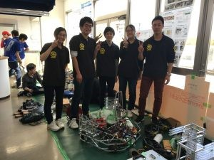

はじめまして。にーしゃです。

今回初投稿となります。

 

早速本題に入らせていただきますが、3/14に大阪大学さんで開かれた関西春ロボコンに出場させていただきました！

 

第一回となる今回のルールは3×3のポールに輪投げをしてビンゴを作る、というものです。

僕達はAPPREでいうパイ投げ方式でビンゴを狙いに行きました。こちらが僕達のロボットです。

大会前一週間くらいで調整を繰り返した結果、養生テープが多くなってしまいましたがそこはご愛嬌ということで（笑）

 

結果ですが３チーム中２位という結果でした。優勝できなかったのは悔しいですが、最後大会最高点で勝った時は思わずハイタッチしてしまいました。youtubeにアーカイブも残っているので暇があればその試合だけでも見てくれると幸いです。

 

Vゴールできなかったこと、優勝できなかったことは心残りではありますが800×800という大きさの機体を一回生だけで作るというのは貴重な経験となりました。

 

今回で学んだことも多く、自分の未熟さを見つめなおす良い機会にもなったと思うのでこれからも精進していきたいと思います。

機体については次回のブログ更新で書いてもらうつもりなので今回はここまでとさせていただきます。

 

それでは、また！ 
