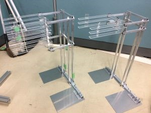
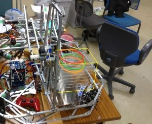
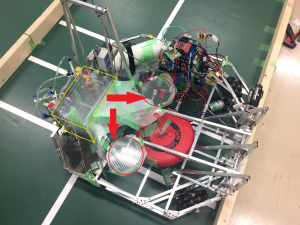

はじめまして、きたやまです。

今回は前回のつづきとして大会で使用した機体やラックの紹介をしたいと思います。

 

 

今大会ではワークとしてリング（輪投げの輪っか）を使います。

 

試合の流れとしては、

ロボットがラックからリングを獲得

→リングをランチャーに供給

→ランチャーからリングを投げてポールに入れる

といった感じです。

 

では具体的な紹介をしていきます。

 

 

使用するリングは試合が始まる前にラックと呼ばれる専用の置き場にセットしておきます。

下の写真は私たちが製作したラックになります。コの字の板が複数重なっているのがおわかりになるでしょうか？

_先端にリングをのせていくことでセット完了です。_

 

リングの取得は、ラックと同じ間隔で重なった長方形の板がラックに入っていくことで完了します。

下の図の黄色く囲ってある部分が供給機構になります。板にリングがのっていますね

 

無事にリングの取得を終えたら、次はランチャーにリングを供給します。

エアシリンダーでリングを後ろから押してやることによって、リングは矢印の方向に滑ってゆきランチャーにセットされるという仕組みです。

ランチャーへのガイドを作るのはかなり難しかったです．．．　途中で止まったり、ランチャーに収まらなかったり．．．

 

リングを供給し終えたら後は発射するだけ！

発射されたリングが3×3のポールに入ると得点が入り、それによってビンゴが達成されるとさらに得点が加算されます。

試合当日はかなりの確率でポールに入れられたと思います。ビンゴもそこそこ達成できました。

 

大まかな機構の紹介は以上となります。

 

 

試合の後は大阪大学、同志社大学の方たちとの交流会がありました。

他大学の技術や製作者ならではの苦労などを見たり聞いたりと、とても勉強になりました。自分たちがボツにしたアイデアに近いものが実物となっていたりするのも印象的でした。

 

今回の大会を通じていろいろな面でスキルアップできたような気がします。至らなかった点は修正し、良かった点は次につなげていきたいと思っております。
