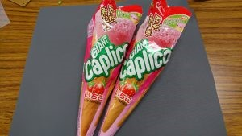

はじめまして、ニケです。

今回は僕たちが出場している大会のひとつ、「キャチロボバトルコンテスト」を紹介します。

 

この大会は京都製作所というおかしの包装などを行っている企業が開催している大会です。

大会の内容は京都製作所が包装しているおかしをワークとして使い、おかしを傷つけずにいかに早く運べるかを競います。

なんとこの大会は、ロボコンにしては珍しく賞金がでます！

優勝賞金はなんと50万円、さらに、優勝の他にも準優勝や審査員賞、さらに参加賞として3万円いただけます。

 

ものを掴むハンドは、NHK学生ロボコンや他の大会でも必ず必要とされる技術ですので、その設計の練習ができ、さらに大会が終わった後に京都製作所の技術者の方から作ったハンドの評価も受けられます。

過去の大会の様子はYoutubeで動画としてアップロードされています。(キャチロボのチャンネルは[こちら](https://www.youtube.com/channel/UC1xyR-sJqXYGEsQu4ysppRA))

 

さて、今年のキャチロボですが、大会は9月9日に開催されます。

今年のワークは「ジャイアントカプリコ」です。

大会へのエントリーは5月中ですので、参加を考えている大学はエントリーを忘れないように気をつけてください！(エントリーシートは[こちら](http://catchrobo.net/team_profile.html)からダウンロードできます)
