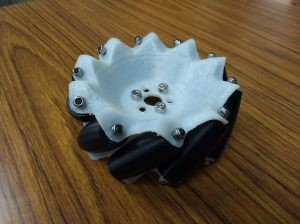

初めまして、3回生ハード班のM.です。

先日、前の4月11日の記事で紹介した機体のタイヤの部分を３Dプリンターで作りました！

今回作成したパーツは元々展示されていた機体についているメカナムの代わりとして作成したものです。

メカナムとは全方向への移動が可能な車輪のひとつで、車輪の外周に複数のローラーが付いており、車輪の駆動とローラーの回転を組み合わせて、全方向への移動を可能にしています。

 

３DプリンターはDesign Labに設置されているものを使用しました。今回作成したパーツを置き換えることによって本来展示用として使われていたメカナムを使用できるようになりました。

Design Labに興味がある方は[こちら](http://www.d-lab.kit.ac.jp/about-vision/)へ！

 

下の画像が作成したメカナムです

逆オレオ（モンデリーズ・インターナショナルの子会社であるナビスコが販売するサンドイッチ状のクッキー。白色の甘いクリームを、2つの円形をしたチョコレートクッキーで挟んである。）みたいと先輩に言われました（笑）

プロジェクトの役に立つことができてとてもうれしく思います！
