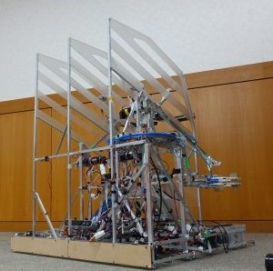
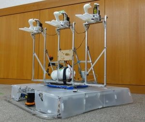

お久しぶりです。ハンスです。

報告が遅くなってしまいましたが、6/10に開催されたNHK学生ロボコンに参加してまいりました。

結果からいうと予選リーグで1勝1敗で決勝トーナメントに進むことができずに予選落ちとなってしまいました。 第一試合の対大阪工業大学戦ではリトライと得点を重ねつつ、時間外ロンバイまで持ち込み得点勝利出来たのですが、 次の対戦相手の九州大学さんはCRの不具合でリトライしている間にあっという間にロンバイを決められてしまい、負けてしまいました。

今回の敗戦で悔やむことはたくさんありますが、一年間ロボコンをやってきて得たこともたくさんあります。 それらのものを苦い思い出を含めて後輩たちに受け継いで今後の成長につなげてほしいと思います。

また、自分自身チームリーダーをやって来て見えてきたことも沢山あるのでその経験を活かして後輩たちをサポートしていこうと思っています。

最後に今年のロボットたちの写真を貼っておきます。 ロボット名は順にSwanとDuckです。

