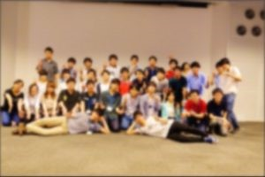

はじめまして、プロです。

投稿がかなり遅れましたが、７月１4日土曜日にOBOG会を行いました。

今年のOB・OG会には全部で12名のOB・OG様にご参加いただきました。

この日のためにわざわざ京都まで駆けつけて下さったりなど、お忙しい中を

わざわざ来てくださったOB・OG様、ありがとうございました。

 

まず、NHK2018大会出場ロボットによる一連動作を行いました。

大会前の練習では、約35秒で Rong Bayを達成できていましたが、

この時は、残念ながらセンサーの不具合があったりとOBOG様の前で

Rong Bayを見せることができませんでした。

 

その後、機体を囲んで大会後の技術交流会のような形で機体解説を行いました。

皆さん興味津々に見入っておられ、質問が飛び交いました。

 

次に別室に移り、旧・新プロジェクトリーダーが昨年度の成果報告や

今年度の運営計画のプレゼン、NHKロボコンの反省報告を行いました。

社会人の視点や時には元ロボコニストの視点から厳しく鋭いアドバイスをいただきました。

是非これからのプロジェクト運営の参考にしていきたいと思います。

 

その後、食堂オルタスに注文しておいた料理で食事会！

おかわりを何回もしてひたすら食べる部員もいれば、食事はそこそこにOBOGさんと現役生で

交流をしたりと、普段聞けない話を聞けたりと楽しい時間でした。

 

今年は、食事会後に余興を行いました。内容はくじを引き、出た番号に対応するお題に挑んでもらい、

お題を達成すると点数が与えられ、チームでその合計得点を競いました。

お題は、ロボコンに関するクイズ、当プロジェクトに関するもののお絵描き、

指定された重さにボルトのつかみ取り、指定された長さに配線を切る、当たり・はずれといった

無条件に点数が与えられたり、引かれたりするものでした。

お題を考えているとき、まさかボルトのつかみ取りでピタリが出るなんて全く思っていませんでしたが、

つかみ取りの一人目で、ある部員がピタリを出してしまいました。重さを発表したときに

皆がはかりの周りに集まって、目盛りを見て "マジだ、やべぇ" ってなってました。

自分も嘘だろって思って二度見しました。

(出ると思っていなくてピタリの点数を高く設定していたので、一人でほぼ勝利が決まってしまいました...)

 

そうこうしている間にあっという間にお別れの時間が来てしまいました。

OBOG様、部員に楽しんでもらえたので良かったと思います。

最後の集合写真です。（プライバシーの観点からぼかしを入れています。）

