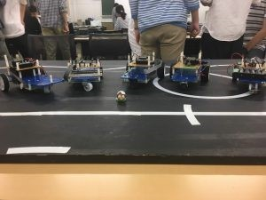

こんにちは、にーしゃです。

遅くなってしまいましたが、6/25に行った部内新人戦の報告をさせていただきます。僕はソフト班なのでソフトの新人戦について書いていこうと思います。同日開催されたハードの新人戦はまた後日投稿される…かも…？

ソフトの新人戦は例年通りライントレースでタイムアタックを行いました。 今年は5人の1回生が出場してくれました。 1回生皆それぞれ夜遅くまで基板を削ってハンダ付けをしたり制御を頑張ってくれたレベルの高い大会となりました！

来月には第二回新人戦となるF^3RCに出場させていただくので応援よろしくお願いします！

下に走行したコースと機体を貼っておきます。

