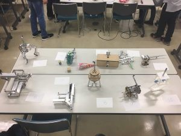

こんにちは！初投稿します、マリエッティです。

 

かなり遅くなってしまいましたが、前回のblogにあるソフト班の新人戦と同時に開催されたハード班の新人戦について報告させていただきます。

ハード班新人戦ではエアシリンダーを用いたロボットハンドを1人で設計、加工をしてもらい、ハンドでワークを保持してもらいます。そしてワーク保持の確実さ、アイデア性、加工のきれいさで評価しました。

今年は参加人数が多く、多種多様で見るのがとても面白かったです。

現在はF3RCに向けて日々頑張ってくれています！

↓全員のハンドの写真です

