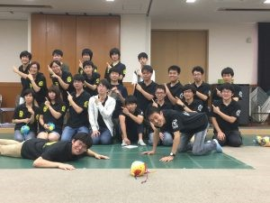

お久しぶりです，ハンスです．

去る8月30日に金沢工業大学の皆さんと交流会を行いました．

いらっしゃった金沢工業大学の皆さんは1年生9人,2年生1人の構成で特に1年生の積極的な姿勢がとても印象的でした．

彼らは朝の5時くらいから青春18切符で鈍行を乗り継いで金沢から遥々やってきたらしいのですが， 疲れた様子は特になく交流会ではみんなピンピンしていました．（若いっていいですなぁ

さて，交流会としてはまず双方運営体制や部内技術のプレゼンをしたりロボコン開発中のビデオを見たりしました． その後は活動場所見学ツアーを行ったり，今年度のロボットのデモを行いました．

それらが終わった後はロボットを囲みながらロボット談義に花を咲かせていたのですが， 話している目の前の相手が数時間前まで全く知らなかった人であったことを考えると， ここまで打ち解けることができるのも場所は違えど志を同じくする者同士ならではなのかな...なんて不思議な気持ちになるハンスでした

例年なら私達も金沢工業大学さんが主催しているSummerRobotContestに参加していて敵同士となるのであまり突っ込んだ話はできないのですが， 今年はそうではないのでSRCの現在の進捗状況やチームの様子など新鮮な話題もあり，交流会の時間はあっという間に過ぎて行きました．

最後に例のごとく集合写真をとりました． 左は京都工芸繊維大学の床を這いずる謎の人物，右は金沢工業大学の最新式MR2です．

終電があるらしく慌ただしく帰って行かれましたが，とても楽しい一時を過ごすことができました．

金沢工業大学の皆さん，ありがとうございました．
