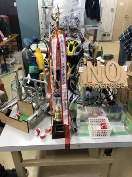
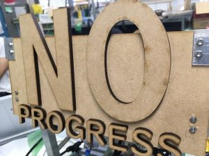

はじめまして。一回生ハード班のひらめです。

部内新人戦でやらかした結果、部内での呼び名がカプリコになりました。詳細は省きます。

あらためまして。一回生ハード班のカプリコです。

今回はF^3RCに参加したNo Progressの自動機の紹介をします。

F^3RCの大会概要、No Progressの大会結果並びに手動機については以下の記事を参照してください。

[F^3RC2018 A-Team新人戦結果、機体紹介(手動機)](http://www.fortefibre.net/blog/?p=3382)

## A-team　自動機紹介

ここからが今回の本題たる自動機の紹介です。(画像右が自動機)

 

A-teamは自動機に対して

1.手動機からガチアサリを受け取る 2.ガチアサリをガチアサリ置き場まで運ぶ 3.アサリ置き場から自動機アサリを集める 4.ゴールエリアにアサリを運び入れる

以上の4点を達成すべき課題として設定していました。

これらの課題を達成すべく、三輪オムニの車台を持つA-team自動機"田中角栄"にはアサリかきこみ機構とバケット傾斜機構の二つの機構に加え、自己位置推定のためにロリコンエンコーダとラインセンサが**搭載されました**。

……どなたですか？搭載されてる**だけ**だろって仰った方は。

そうですよ。そのとおりですよ。わるいですか。

……

三輪オムニの車台が完成し、ソフト班の足回り制御の練習が始まるまではよかったのです。そこまではよかったのです…

最初の問題はエンコーダが正常に動かないこと。 この際に練習フィールドの中で荒ぶった結果、田中角栄自動機にはbreakerのあだ名がつきました。原因究明の努力もむなしく不具合の原因は特定されず、自動機のエンコーダは使われないことに。悲しい。これで自己位置推定の手段はラインセンサのみとなり、取り付けられたエンコーダはすべて飾りになりました。とても悲しい

次にラインセンサの不調。 ラインセンサが3回に2回、間違った値を送り付けるという問題が発生しましたがセッティングタイム中に1/3を引き当てるということで解決しました。(解決とは？)

機構面でも問題は山積で青息吐息でした。

設計者間の連携不足、根本的な設計上の問題、組み立て時に干渉する機構、大会直前の設計と戦略の変更……

…諸事情によってアサリ回収の要たるアサリかきこみ機構は取り外しの上、改修の後に再度とりつけられ、大きい飾りになりました。悲しい (下の画像はアサリかきこみ機構の名残。動かない)

最終的に田中角栄自動機はアサリに向かって突進してはプルプルふるえるコンピューター付きブルドーザーになりました。ﾄﾞｳｼﾃｺｳﾅｯﾀ…

結局、大会にて自動機はアサリを一つも回収できず、手動機に頼りきりになってしまいました。

結果こそ喜ばしいものでしたが、自動機担当としては反省すべき点の多い大会となりました。
