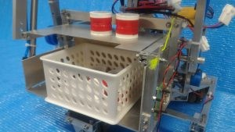

こんにちは、ずしです。

前回、大賞受賞理由の一つに独特な戦略がある、という話をしましたが、今回はその戦略について紹介します。

あ、前回といえばよく考えたらあれは大会結果の説明でも短編小説でもなくただの私の日記ですね。

気にしたら負けです。

 

さて、戦略についてですが、まずは大会本番でよく見られた戦略を紹介します。

1\. 手動機がアサリを４つ回収

2\. 手動機がガチアサリを構成

3\. 手動機が自動機にガチアサリを受け渡し

ここから手動機と自動機が同時に行動することになります。

まずは自動機の動き。

4\. 自動機がガチアサリを自動機ガチアサリ置き場に納品（チャンスタイム）

5\. 自動機がアサリを回収

6\. 自動機がアサリをゴールエリアに納品

この間に手動機も動きます。

7\. 手動機がアサリを回収

8\. チャンスタイムになった後、手動機がアサリをゴールエリアに納品

9\. ゴールエリアにアサリが１０個以上溜まった後、手動機がハマグリを回収

10\. 手動機がハマグリをハマグリ台に納品（ノックアウト勝利）

 

これが大半のチームの戦略でした。何の面白みもないですね。

私たちも最初期はこの方法で行こうと考えていたのですが、あることに気づきました。

**「はじめ自動機暇じゃね？」**

 

そういえば、この頃はまだ茜ちゃんではなくただの自動機でした。

茜ちゃんになるのはもっと後の話。

葵ちゃんになるのはもうちょっと後の話。

でもここでは（何となく）、以下、自動機を茜ちゃん、手動機を葵ちゃんとしておきます。

 

で、茜ちゃんに空白の時間があることに気づいた私たちはその空白時間のうちにアサリを回収することにしました。

これにより常に茜ちゃんと葵ちゃんが常に同時に動き、タスクを消化することができるようになります。

また、葵ちゃんの移動時間を減らすため、茜ちゃんが10個のアサリをゴールエリアに納品するようにしました。

 

つまり私たちの戦略は以下のようになります。

1\. 葵ちゃんがアサリを４個と２個に分けて回収

2\. 葵ちゃんがアサリ４個でガチアサリを構成（２個は把持したまま）

ここまでの時間に茜ちゃんも動きます。

3\. 茜ちゃんがアサリを８個回収、スタートエリアに帰還

そしてガチアサリ、アサリが茜ちゃんに集められます。

4\. 葵ちゃんが茜ちゃんにガチアサリとアサリ２個を受け渡し

ここで茜ちゃんはガチアサリとアサリ１０個を把持することになります。

まずは茜ちゃんの動き。

5\. 茜ちゃんがガチアサリを自動機ガチアサリ置き場に納品（チャンスタイム）

6\. 茜ちゃんがアサリ１０個をゴールエリアに納品

ここで茜ちゃんのタスクは終わり、葵ちゃんはハマグリを納品することができるようになります。

一方その頃。

葵ちゃんはガチアサリとアサリを受け渡した後、早速ハマグリ回収に向かっています。

7\. 葵ちゃんがハマグリを回収

8\. 茜ちゃんがアサリを納品後、葵ちゃんがハマグリをハマグリ台に納品（ノックアウト勝利）

 

**多分これが一番早いと思います。**

そして、後もう一つ利点があります。

**茜ちゃんが動いてるところを確実に見ることができる。**

**ｱｶﾈﾁｬﾝｶﾜｲｲﾔｯﾀｰ**

 

他のチームでは手動機でガチアサリがなかなか完成せず、自動機が動くことが出来なかったパターンがありました。

こうなると最悪茜ちゃんは葵ちゃんを待ち続けたまま試合終了になってしまう可能性があります。

それに比べ、この戦略ではスタート直後から茜ちゃんが動くことが出来、確実に**かわいい**茜ちゃんを見ることが出来ます。

**ｱｶﾈﾁｬﾝｶﾜｲｲﾔｯﾀｰ**

 

↑葵ちゃんからガチアサリとアサリ２個を受け取った時の茜ちゃん

 

最後に応援について。

大会本番では観客席から大音量の某コールが聞こえてくることが予測されました。

そこで、新たにｱｶﾈﾁｬﾝコールを開発しました。

試合中に観客席から「**ｱｶﾈﾁｬﾝｶﾜｲｲﾔｯﾀｰ!!!**」と叫ぶことにより茜ちゃんも元気づけられたことでしょう（知らんけど）。

さて、この戦略を実行するためには（設計上）色々な苦労があったのですがこれについてはまた次回以降で。

 

次回はがんばります。

ずしでした。
