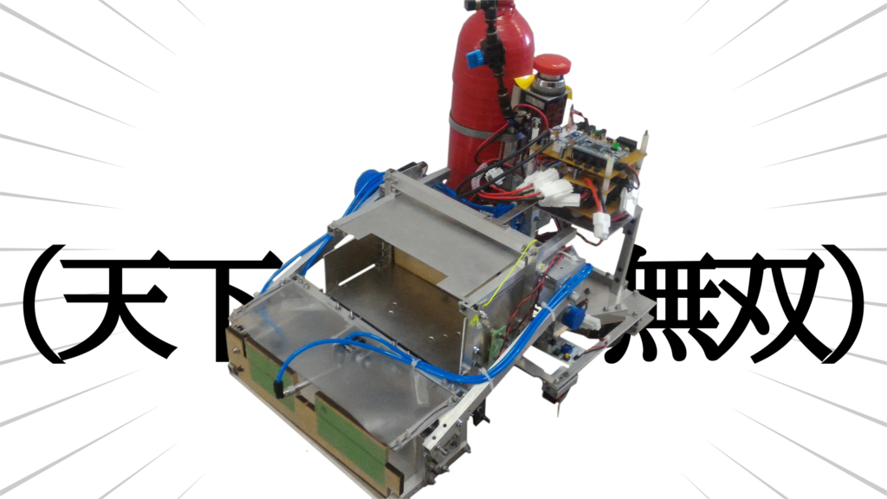
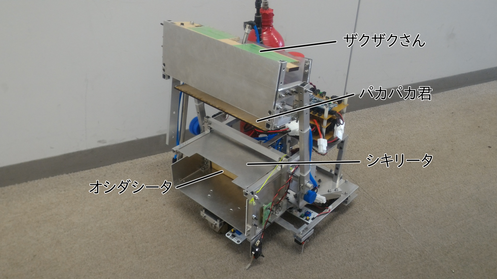

お久しぶりです、ずしです。

### 茜ちゃんって誰？機構は？制御は？彼氏は？ガチ恋勢がヤバすぎると話題に

関東の大会であるF^3RCに突然殴り込みに行った茜ちゃん。

でも皆さん、本当は茜ちゃんについて詳しく知らないのではないですか？

Vゴールにより大会運営を安心させてF^3RC大賞を受賞しましたが、最速Vゴールの秘密は何なんでしょうか？

機構や制御、彼氏についても気になりますよね。

今回はそんな茜ちゃんについて自分（制御担当者）なりに調べてみました！

 

#### 茜ちゃんのプロフィール

茜ちゃんはﾊﾞﾔﾘｰｽｱｶﾈﾁｬﾝの自動機です。

体重：約4.5kg(リポバッテリ除く)

後は知りません。（適当）

 

さて、茜ちゃんのお仕事については前回の通りですが、複雑な作戦故にそれを実行するための機構はとても変態独創性の強いものになりました。

**紅茶を飲みながら機構を考えるとこういうことになります。**

 

茜ちゃんの機構は大きく分けるとアーム部と荷台部に分けられます。

アーム部はザクザクさんとパカパカ君から成り、荷台部はシキリータとオシダシータから成ります。

 

 

#### 茜ちゃんのひみつ１　〜ザクザクさん〜

８個のアサリを一瞬にして収穫するための機構です。

エアシリンダで動作するのですが、スピコンをつけない脳筋仕様にすることにより多少の波々ロンリウムをものともせずにアサリをかき集めてくれます。つよい。

アサリを集めた後、アームにより上へ上げることが出来ます。

アサリを集めることから潮干狩りを連想し、ザクザクさんと名付けられました。

 

#### 茜ちゃんのひみつ２　〜パカパカ君〜

茜ちゃんは８個のアサリ、２個のアサリ、ガチアサリを別々に把持する必要があります。

８個のアサリは最後までアーム部に入っているのですが、このアサリを荷台へ移すための機構です。

開くとアサリが自由落下します。

パカパカするのでパカパカ君と名付けられました。（小学生並みのネーミングセンス）

 

#### 茜ちゃんのひみつ３　〜シキリータ〜

葵ちゃんから受け取った２個のアサリとガチアサリを分けておくための機構です。

これを動かすことにより２個のアサリをオシダシータ前へ落とすことが出来ます。

アクチュエータ？そんなものはついていません。

オシダシータの動きに連動し、ガチアサリを納品した後、動作します。

ハード班頑張った。

仕切り板なのでシキリータです。（投げやり）

 

#### 茜ちゃんのひみつ４　〜オシダシータ〜

アサリやガチアサリをガチアサリ置き場やゴールエリアに納品するための機構です。

スピコンを調節しないとガチアサリ納品時にガチアサリの中身が飛び出します。（とびだすなかみ）

押し出し板なので(ry

 

#### 茜ちゃんのひみつ５　〜制御編〜

茜ちゃんの自己位置は基本的に接地エンコーダで求めています。

あとたまに壁にぶつけて向きを修正しています。

ラインセンサ？あるだけです。（マジ論理有無！）

 

 

いかがでしたでしょうか？

 

**気に入ったらシェア！！！**

 

ずしでした。
