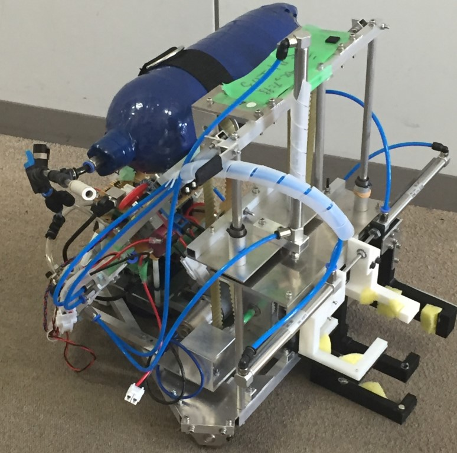

初めまして、F衛門です。今更ですがF^3RC2018　ﾊﾞﾔﾘｰｽｱｶﾈﾁｬﾝの手動機(通称葵ちゃん)の紹介をします。

葵ちゃん(手動機)

葵ちゃんはアサリ２個用のハンドとアサリ４個用のハンドを搭載しています。(画像右側)  
２個用ハンド(白)：アサリを2つつかんで茜ちゃん(自動機)に納品する役割を持ちます。  
   　　　　　　　 3Dプリンターで製作しました。  
４個用ハンド(黒)：アサリを４つつかんでその４つのアサリでガチあさりを作り、茜ちゃん  
　　　　　　　　　に納品する役割を持ちます。  
　　　　　　　　　こちらも3Dプリンターで製作しましたが、強度が足りなかったので  
　　　　　　　　　アルミ板で外側を補強しました。補強は大会当日に初めてしました  
　　　　　　　　　画像のハンドは４代目です　  
それぞれのハンドはベルトとエアシリンダーで上下します。  
この葵ちゃん実はベルトの上下(4パターン)やエアシリンダーの開閉等コマンドが多く操縦がかなり難しいです。  
・操縦者R君の声　  
　自分のせいですが、後から機能を追加していったため操作が難しくなってしまい、しかも、本番直前までモーターの問題で動かなくつらい日々を送りました。しかし、ハードのH君（＋α）の頑張りにより本番調子に乗った葵ちゃんが見られました。葵ちゃんの機嫌取りなどで操縦の練習があまりでなかったので、操縦ミスが多かったですが（実際それが負けの要因の一つ）　本番に思い付いたものを駆使したりして楽しく操縦できました。  
・製作者H君の声  
　　葵ちゃんの全体のCADデータは見ることが恐れ多くて自分もまだお目にかかれていませんが、気が付いたら葵ちゃんが生まれていて奇跡だなと思います。大会の前日に人生で初めてギア比という概念を知って上下機構に使っているモーターを変更したり、先輩をやけどさせてしまったり、あれ？このレール歪んでない！？となりもはやレールのねじを外して可動域に柔軟性を持たせたレールにしたり、大会当日に会場で黒のハンドにハンドドリルで頑張って穴を開けたり、etc…いろいろあったけど大会の第一戦で葵ちゃんの動いてる姿を目にしたときはわが子が初めて歩くのを見た親の気持ちが分かった気がしました。手動操作に似合わないアサリの取り方のポンコツな葵ちゃんですが操縦者のR君が頑張ってくれたおかげで大会では機嫌よく動いてくれてよかったです。ｱｵｲﾁｬﾝｶﾜｲｲﾔｯﾀｰ
