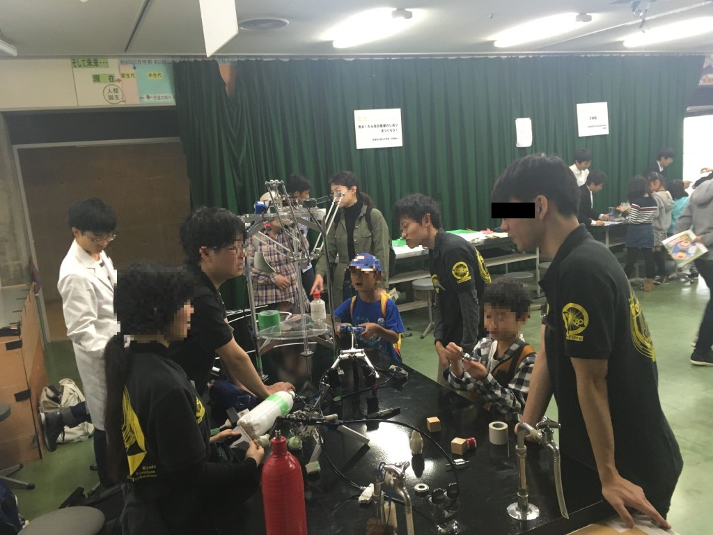
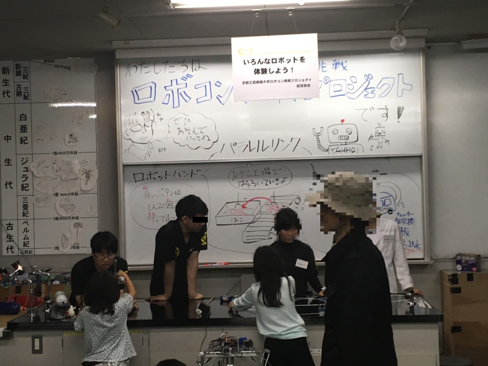
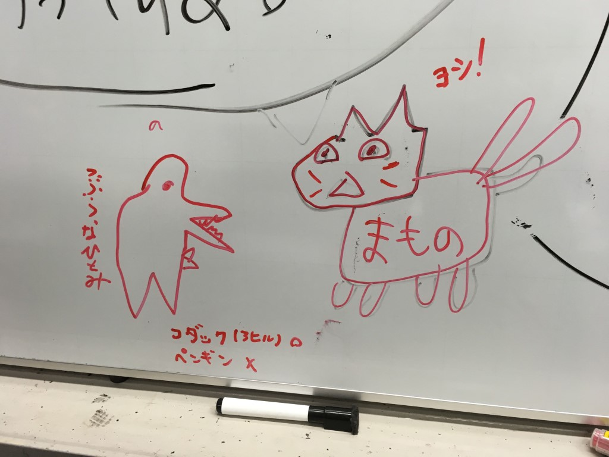

初めまして！タレットパンチプレス……もとい、たれパンというものです！

いささか前のことになりますが、11月10日と11日に京都青少年科学センターでは『青少年のための科学の祭典』が開かれました。これは、京都府在住の学生や子供たちが様々な科学技術に触れ、興味も持ってもらうためのイベントです。

私たちForteFibreもここに「いろんなロボットを体験しよう！」というブースを出展させてもらいました。自作したロボットたちを、子供たちに実際に操作してもらうコーナーです。

今回は、毎年恒例のロボットハンドに、ライントレーサー、そしてパラレルリンクロボットによるUFOキャッチャーマシンを持ち込ませていただきました。

ロボットハンドでは2種類のハンドをつかっていろいろなものを積み上げたり、ライントレーサーでは自分でコースを作ってロボットを動かしてもらったり、体験を重視したブースを目指しました。

そしてなにより重視したのは、「どうやって動いているのか、どうやって作ったのか」という点に興味をもってもらうことです。

ロボットを「そういう風に動くもの」としてではなく、どういう原理で動いているのか、何を目的としているのか、そしてどうしたら改良できるのか、といったただ楽しいだけではなく、その一歩先につながるようなブースに出来ていたら何よりの幸いです。

この記事をみている人達も、ロボットを作ってみたい！思うように制御してみたい！と思っているのなら……レッツ！ロボコン！

