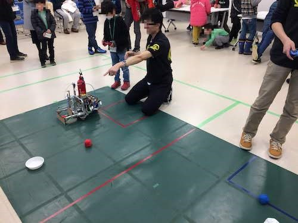
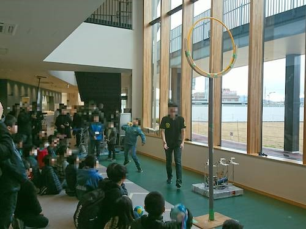

お久しぶりです！もものきです！

私達は2/16(土)に綾部市主催で開催された「ロボットサミット2019」に参加してきました．

これは，[科学の祭典](https://www.fortefibre.net/blog/?p=3488) と同じく我々の広報活動の一環となっています．

具体的な内容([詳細](https://maizuru.mypl.net/module/photo?p=bti&id=182319&ttl=ロボットサミット2019))としては

- 顧問の先生による一般向けの講演
- NHK2018機体によるデモ
- 小・中学生向けの操縦体験
    - パラレルリンクロボット
    - F3RCロボット

という感じで，ロボットを実際に動かしてみたり，話を聞いたりすることでロボットのことを知ろうという内容になっています！

参加者の方々(小学生の方が多かった)は皆さん熱心に話を聞いてくれたり，操縦体験をしてくれたので我々もとても楽しかったです！

ちなみに， このときの様子がKBS京都で17:45~18:00の「ニュースフラッシュ」内で放送されるそうです！

次回もおそらく開催されると思うので興味のある方は奮ってご参加ください！！！ (時期が今年は特殊で，例年は9~10月頃)
