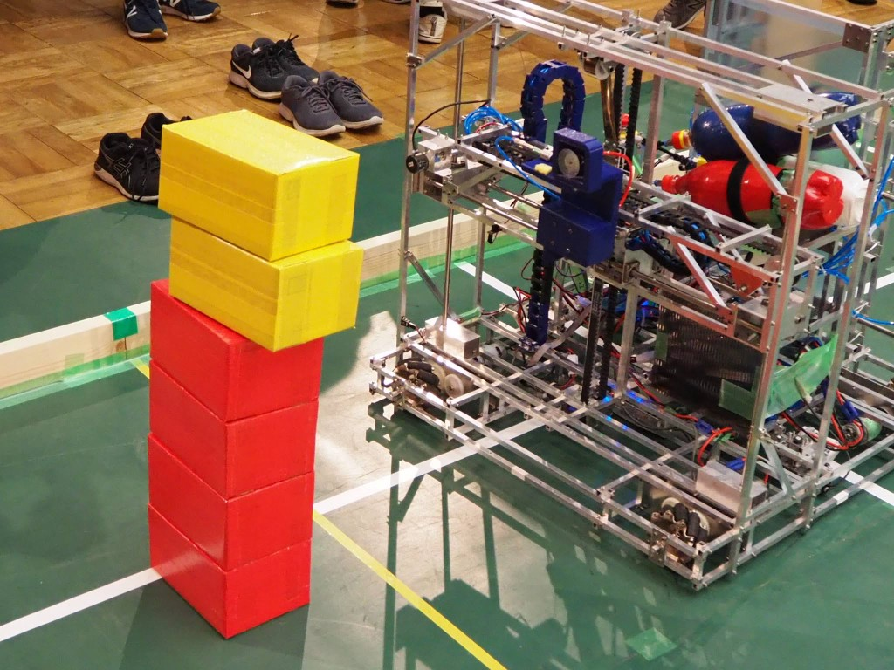
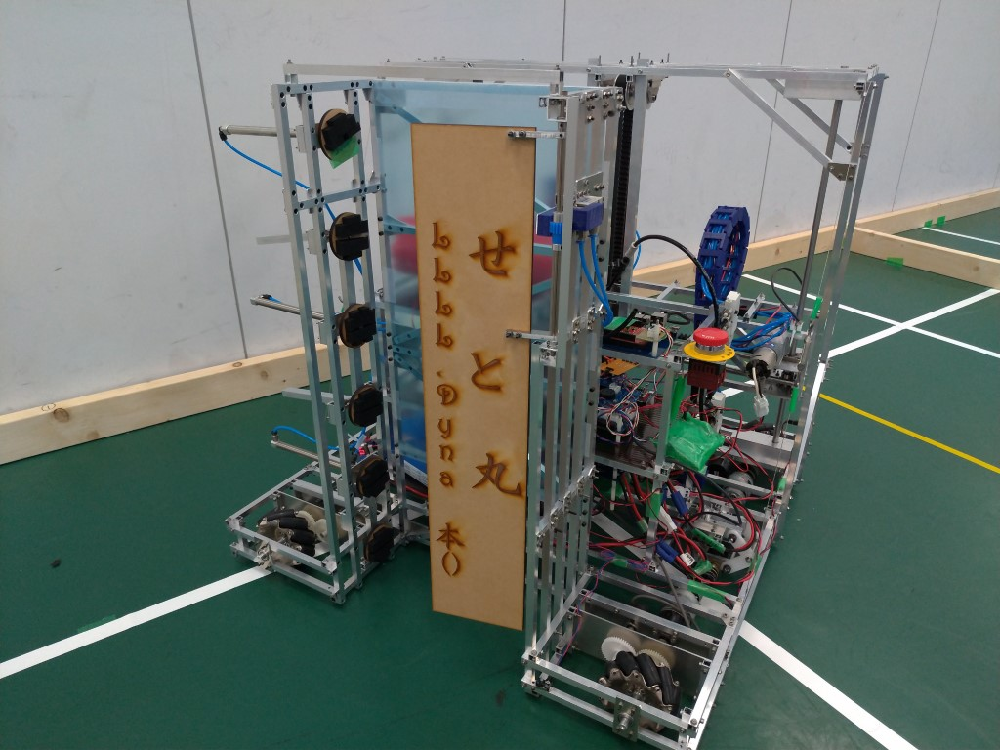
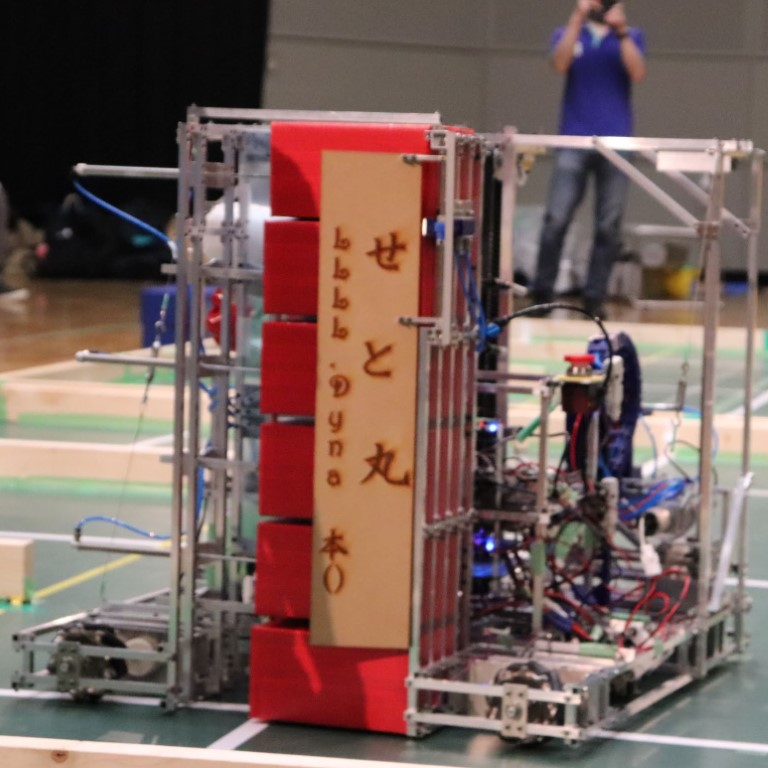
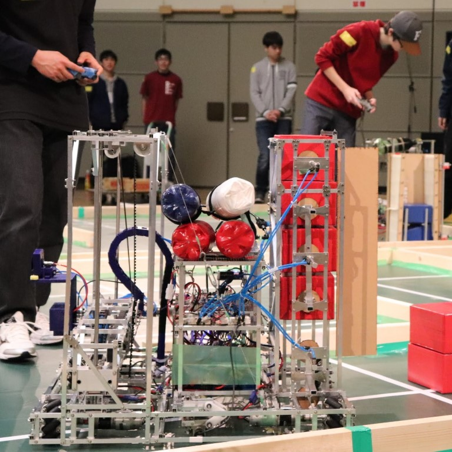
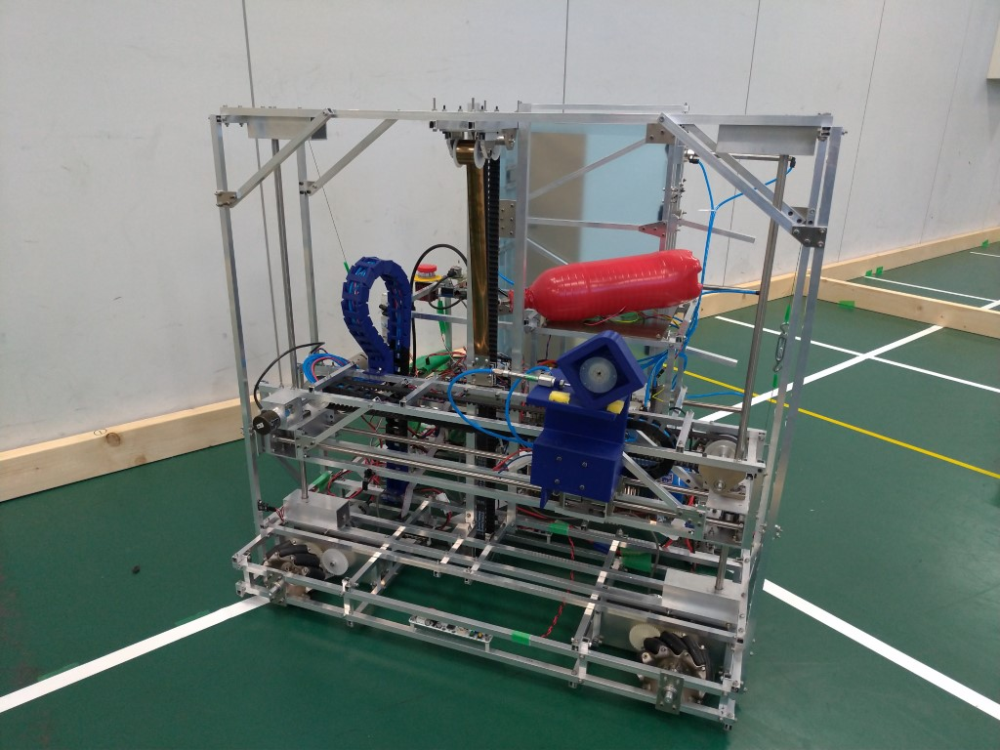
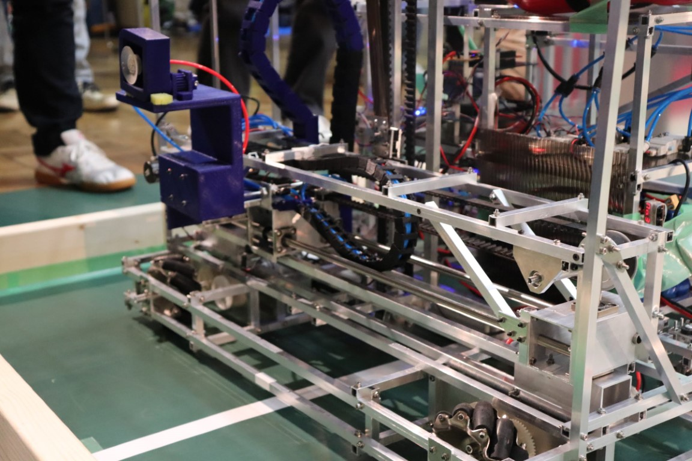
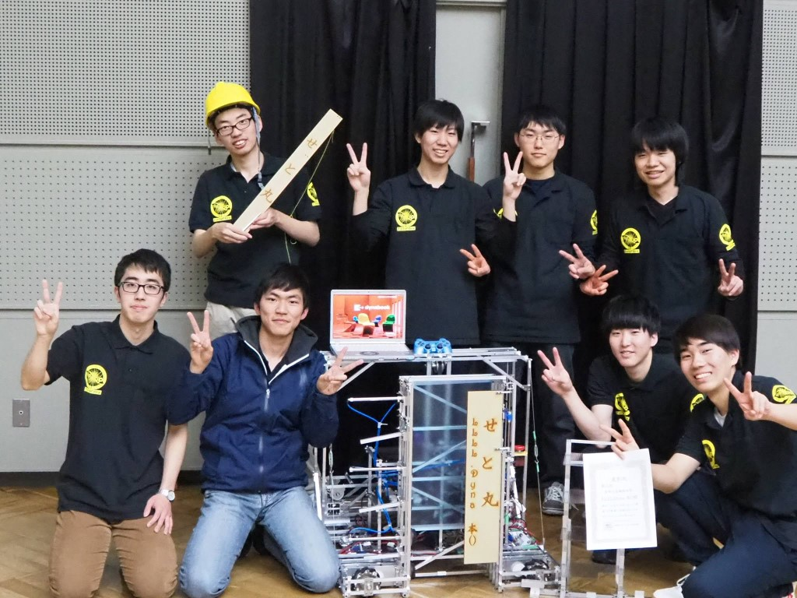
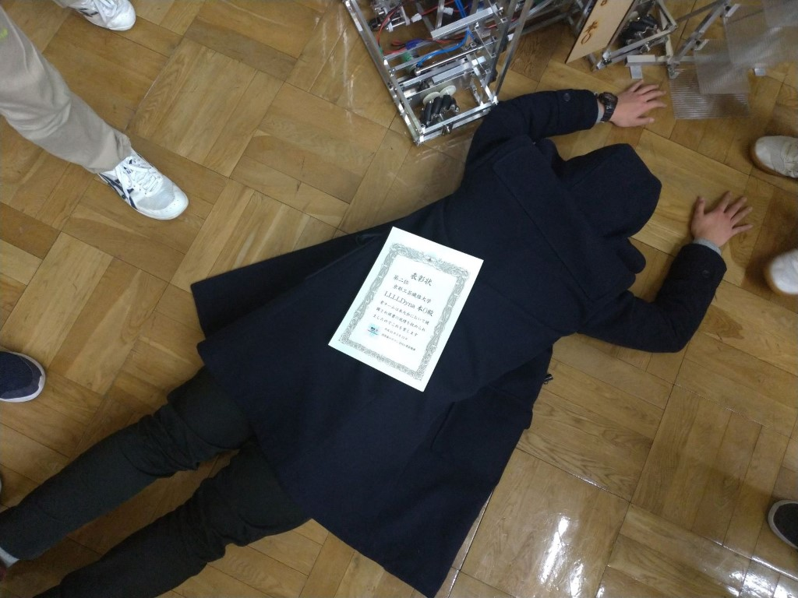

はじめまして。1回生ソフト班のピラニアです。

ForteFibre魚類チームの一員として日々活動しています。

今回は、タイトルにもあるとおり、関西春ロボコン2019に参加した報告です。

## 大会概要

関西春ロボは技術の向上や新人の育成を目的として、 大阪大学Robohanさん、同志社大学ロボット研究会さん、そして当プロジェクトによって開催されている大会です。第2回となる今回は計5校が参加し、白熱した試合を繰り広げました。

## ルール

今回のルールは段ボールのワークを積み、タワーを作るというものです。タワーを作る場所や向きによって得点が決まり、3分間で何点稼げるかを競います。さらに、一定の条件を満たした上で、タワーの上にゴールデンボックスを2つ載せると「Tower」となり、達成した時点で勝利が確定します!!

こうなればTowerです

↓↓ さらに詳しいルールを知りたい方は、以下のリンクからどうぞ(公式サイトに飛びます)

[RULE | 関西春ロボコン](http://関西春ロボコン.com/rule.html)

## 機体解説

それでは、当プロジェクトがこの大会に参加するために結成したチーム、「LLLL.Dyna本()（レッツダイナブック〜ポンチを添えて〜）」が制作したロボットを紹介していきたいと思いま...え？チーム名がおかしい？文字と読み方が合ってない、まるで深夜テンションで決めたチーム名みたいに見えるって？

心配しないでください、チーム名は限りなく正常な思考の元でかつ全メンバーの同意の下決定されました(余計に心配されそうですが)。

さて、気を取り直して。これが私たちが制作したロボット、その名も「せと丸」です!!

せと丸には大きく分けて2種類の機構が搭載されています。一つはノーマルボックスを積むためのStairwell、もう一つはゴールデンボックスを積むためのG-Forceです。

Stairwellとは吹き抜けという意味で、その名の通り足回りを貫く吹き抜けがメインの機構です。内部のハンドでボックスを保持、そのまま扉をを閉めてからハンドを離せばきれいなボックスタワーが完成します。扉はMDF製で、チーム名とロボット名が彫り込まれているのがポイントです。

- 
    
- 
    

G-Forceはゴールデンボックスを保持するためのハンドとそれを移動させるためのユニットからなる機構です。ハンドはx軸、y軸方向に自由自在に動くことができ、様々な位置のゴールデンボックスに狙いを定めます。固定方法には吸引を採用しており、これが機構名の由来です。けっしてグラボの名前が由来ではありませんので誤解なきよう。

- 
    
- 
    

## 大会結果

大会結果ですが、私たちのチームは5チーム中2位という結果でした。優勝できなかったのは悔しいですが、チーム全員が大きく成長した大会だったと思います。この経験を生かし、次の大会では優勝できるように頑張っていきます!!

- 
    
    チームメンバーと共に
    
- 
    
    賞状と魚類仲間のひらめ君です
    

それでは、また!!
