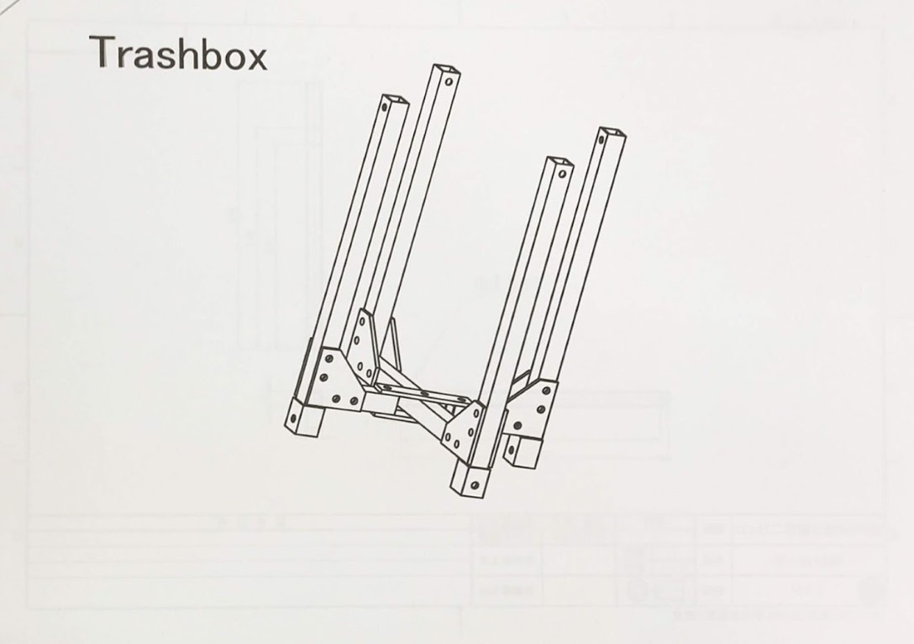
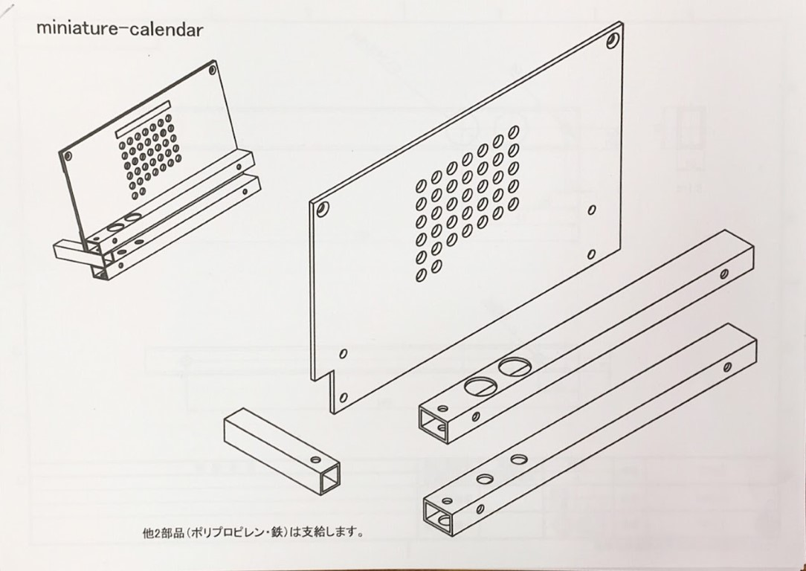

　こんにちは、新二回生ハード班のぶたなぽです。

　4/4(木)に新入生歓迎オリエンテーションがありましたのでそのことについて少しと、「入りたいかも......」な人(もちろん新1回生だけでなく、新2回生以上や高専からの編入生の人も......)に伝えておきたい情報を少し書きたいと思います。

## 新歓オリエンテーション

　4/4(木)に新歓オリエンテーションがありました！

　僕たちは体育館と60周年記念館の２ケ所で新入生を勧誘していました。

　体育館での勧誘はうまくいっていましたが、実際のロボットを展示していた60周年記念館の方は初めはあまり人が来ず、 というかそもそもの目の前の通りの新入生の行き交いが少なかったりで少し不安でしたが、最終的には十分以上に多くの新入生が来てくれて賑わっていました。

　そしてもう入部届まで出してくれた子までいて、これは**順調な滑り出し**と言えるでしょう！

　嬉しい話ですね！

　その際に来てくれた人は設計工学域の人が多かったのですが、やりたいなと思っている人は学部のことを考えずに来てみてください！

　　僕自身、情報工学課程ですが入ったのはハード班ですし、ロボットのことに触れたことが今までない初心者でした。

　ですが、新入生教育で先輩からの教えを受けて、今十分以上に楽しく活動できているので、**学部だったりで躊躇せず**堂々と見学しに来てください！

## これからの新歓予定

　ロボコンに興味があります！という方は以下の日程で**WLの部室**で新入生向けの説明会がありますので参加してください。

　4/8 (月)　2限

　4/9 (火)　5限

　4/10(水)　2限

　4/12(金)　5限

　部室へのアクセスは[こちら](https://www.fortefibre.net/access.html)です。

もちろん、↑の説明会に来れないという人は好きなタイミングで部室に来ていただけたら個別で対応します。

　入部締め切りは4/12(金)ですのでお気をつけてください。

また、ハード班の新入生は工具に慣れる目的で↓の4種類+いい感じの画像が見つからなかった1種類の計5種類のミニチュアを作る期間を4/28まで設けます(どれか一つで十分ですが、全部作っても⁉)。

　いつ来ても対応できるように心がけますので、WL棟の僕らの部室に来たいときに来てください！

　いつでも軽い気持ちで来てくれると嬉しいです！

　新入生の訪問、歓迎してます！
