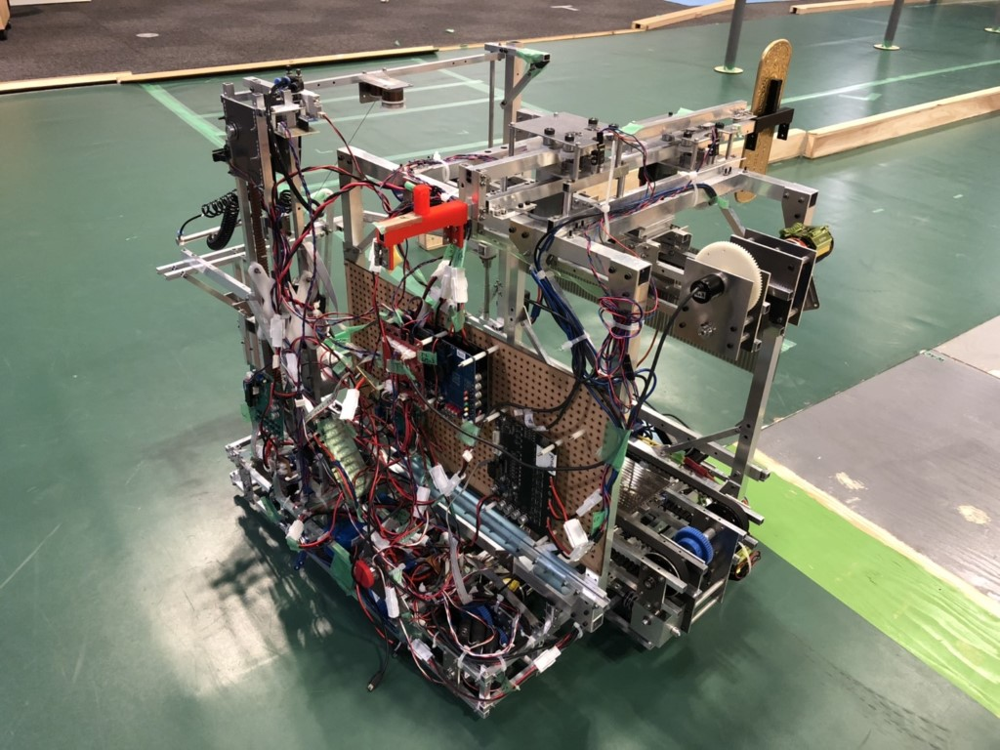
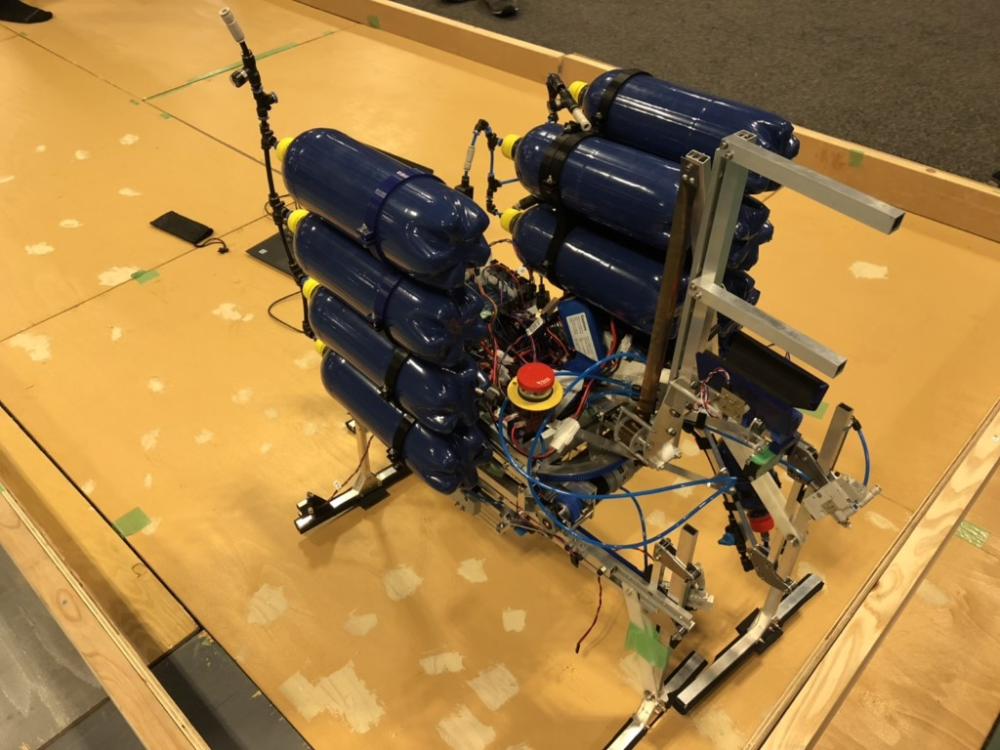
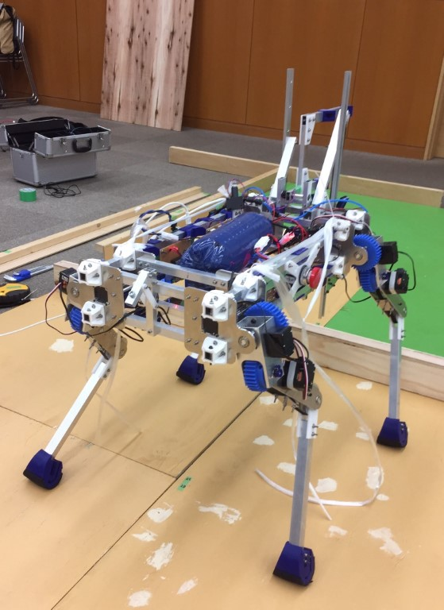

お久しぶりです。プロです。

早速ですが、今年度のプロジェクトリーダーになりました。

1年間プロジェクトをまとめられるよう頑張っていきたいと思います。

また先日、5/26に開催されたNHK学生ロボコンに出場してきました。

結果は予選リーグで0勝2敗と決勝リーグに進めず、予選落ちという結果になってしまいました。  
第1試合目の東京大学戦ではゲルゲの受け渡しに失敗し、リトライ中にウ－ハイを決められ負けてしましました。  
次の対戦相手の熊本大学戦では、MR2が不具合を起こし初期化ができなく動かせずに負けてしまいました。

今年は自分たちのロボットが動いてるところをほとんど見せることができなく、多くの課題が見える結果となりました。

見つかった課題を改善し、次にはその問題が起こらないようにしようと思います。

また、自分自身去年と今年2年間NHK学生ロボコンに関わったので、この経験から後輩たちのサポートができたらなと思います。

今年のロボットの写真を貼っておきます。  
名前はnot-houseとnot-horseです。

- 
    
- 
    

最後に大会に出場したロボットは↑の2つですが、制御が間に合わず大会出場を断念した自分が設計していた4脚ロボットの写真を貼っておきます。

