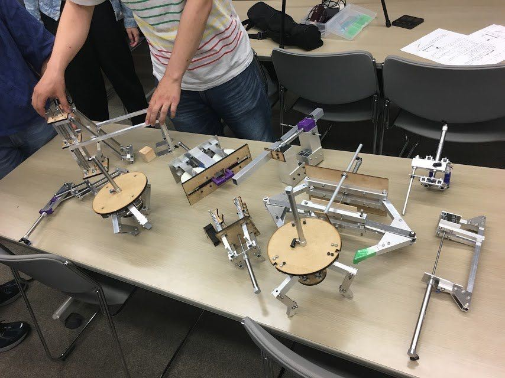

はじめまして、1回生ハード班のhachiです。  
先日第一回新人戦が行われました。

ルールはハード班新入生全員が各自一つのロボットハンドを作り、それでカラーボールや積み木などを掴みます。そしてその出来栄えを他の部員が評価するものでした。

当日まで倉庫にこもり加工している人もいました。中には先輩の力を借りている人もいました。

当日、ハンドが完成しなかった人や、うまくつかめなかった人もいましたが、楽しく新人戦を終えることができました。

今は次の大会に向けて、よかったことや悪かったことを考えています。

↓全員のハンドの写真です。

