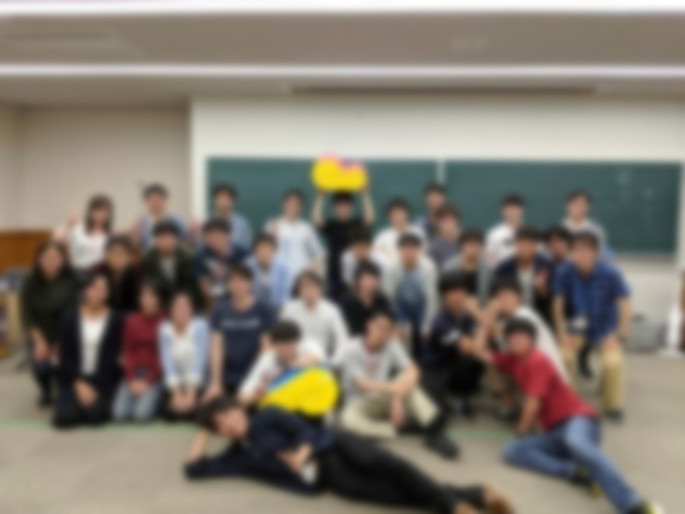

お久しぶりです。2回生ハード班のF衛門です。

今月の15日に多目的室にてOBOG会が行われました。これはOBOGの方々と交流したり、今年の活動を報告したりする会です。  
今年は14名のOBOG様にご参加いただきました。

まず、今年のNHKロボコンで使用した機体を実際の競技の通り動かし、その後に機体を囲んで詳しい機体解説を行いました。  
OBOGの方々からたくさん質問が飛び交っていました。

その後別室に移り、新旧プロジェクトリーダーが昨年度の成果報告や今年度のNHKロボコンの報告、運営計画のプレゼンを行いました。  
プロジェクトの運営や技術開発、NHKロボコンについてなど、数多くのアドバイスや厳しい指摘もいただきました。  
これらを今後のプロジェクト運営に活かせるように、参考にしたいと思います。

その後多目的室に戻り、オルタスに頼んでいた料理で食事会をしました。  
食事をしながら、気軽にOBOGの方々と交流できたので、いつもは聞けないような話を質問できたりと楽しくかつ貴重な時間になりました。  
自分もハードの技術的な話やチームのマネジメントの話まで、普段なかなか話す機会のない方々から色々なことを教えていただきました。

食事会後には余興を行いました。  
余興では5班に分かれ、お題をクリアすることで入る得点を競い合います。参加者の皆さんには1番から35番までの任意の番号を選んでもらい、その番号に対応するお題に挑戦してもらいました。  
お題にはロボコンに関するクイズやお絵描き、モーター等の重さ当てなどがありました。  
クイズにはロボコンに関係するものの値段を1円単位で当てるというものがあったのですが、あるOBの方がそれをピッタリで当て、会場全体が大盛り上がりになったのが印象に残っています。

余興が思っていた以上に盛り上がった事もあり、あっという間に時間が過ぎて気付けば解散の時間になってしまっていました。

OBOGさんにも楽しんでいただけたようだったので良かったです。

↓OBOG会の終了直後に撮った集合写真です(プライバシーの観点からぼかしを入れています)

