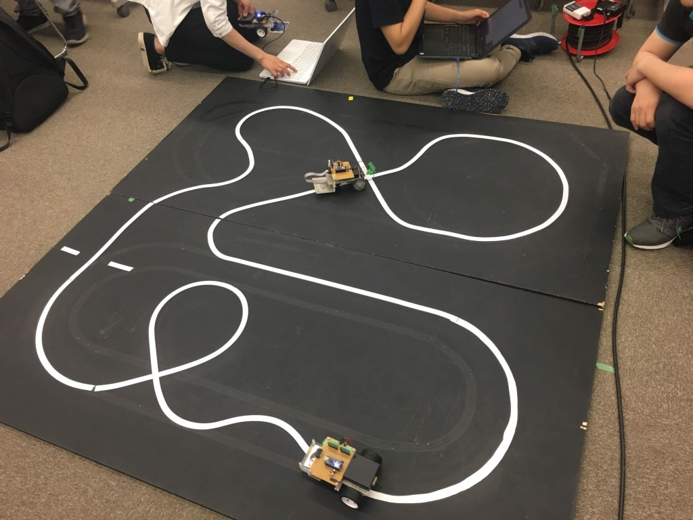
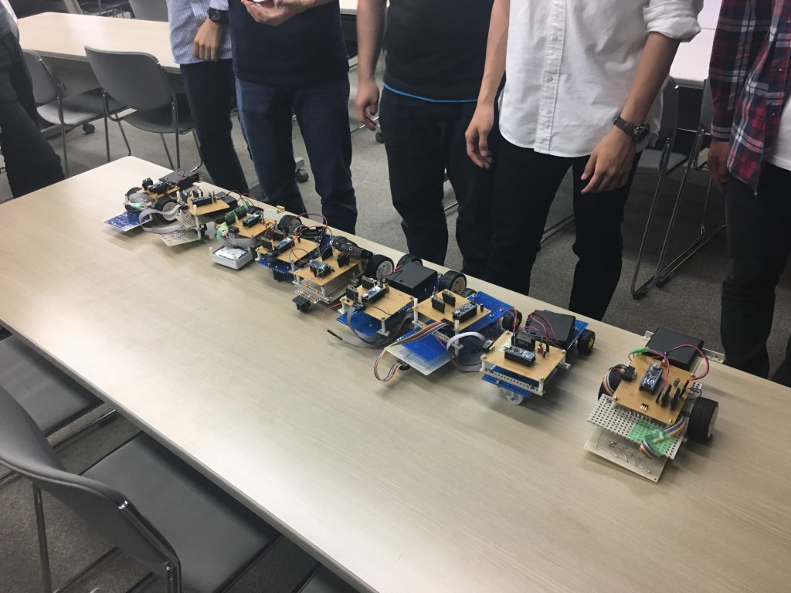

はじめまして，1回生ソフト班のchapatiです．6月中旬に第一回新人戦が開催されました．この記事ではソフトの部のことについて書きます．

ソフトの部では，各自でライントレースカーを制作した上で，所定のコースの一周のタイムを競う形で競技が行われました．

制御の試行錯誤をする中でハンダ不良でセンサの値が正しく読み取れなかったり，電源として用いたニッケル水素電池がメモリー効果の影響ですぐに切れてしまうなど様々な壁がありましたが，新人戦当日には出場者全員がライントレースカーを動作するところまで持っていくことができていました．

今はソフト班は制御練習組とSRC出場組に分かれて戦略の立案などを行っています．今回の新人戦を通して得られたものを活かしていければと思います．

新人戦直前のリハーサルの様子

出場者が作ったライントレースカー
