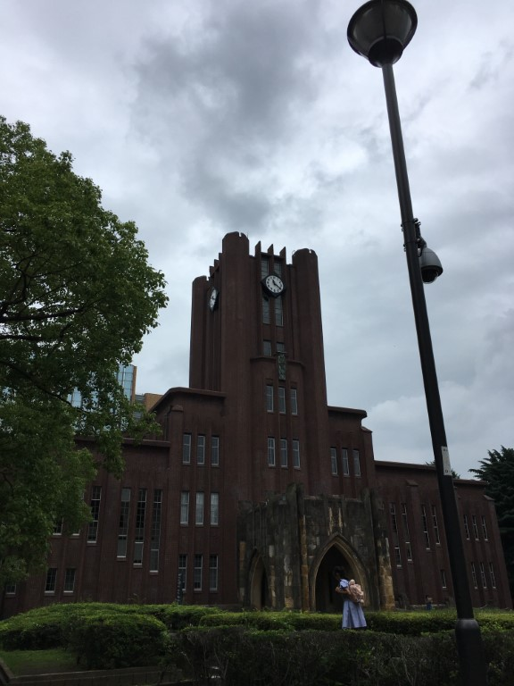

お久しぶりです。ひらめです。高温に弱い生物なので蝉が鳴き始めて夏が存在感を増すたびに悲しみを深めています。

皆様、連休はいかがお過ごしでしたか。

僕はNHK学生ロボコンの放送を見たあと、水族館に行ってました。さすが海の日、めっちゃヒトが多かったです。

閑話休題

去る2019年6月23日、東京大学にて行われた技術交流会に参加しました。

参加大学は東京大学、東京工業大学、千葉大学、横浜国立大学、早稲田大学、工学院大学、豊橋技術科学大学、京都工芸繊維大学の8大学。

お昼に正門で集合。ものづくり実験工房にて各参加大学による顔合わせとプレゼンテーションの後、小休止がてら活動場所の見学をしました。

ここで写真は挙げられませんが、興味深いものがたくさんありました。

活動場所を見るのはその大学の普段の活動の様子や創意工夫が垣間見えるので、とても面白いですね。

ものづくり実験工房前での記念撮影後、くだんのSUBWAY前フィールドでの競技実演ならびに機体紹介がありました。

本当にSUBWAYの前でした

近くから機体を見ることができ、また機体についての話も聞くことができてずっと興奮していました。

また機体紹介の合間にも他大学の方と東京大学さんの機体を話題にして交流ができ、非常に楽しく有意義な時間を過ごせました。

主催校の東京大学さん、そして交流して頂いた各参加大学の皆様。本当にありがとうございました。

それでは、またいずれ。
