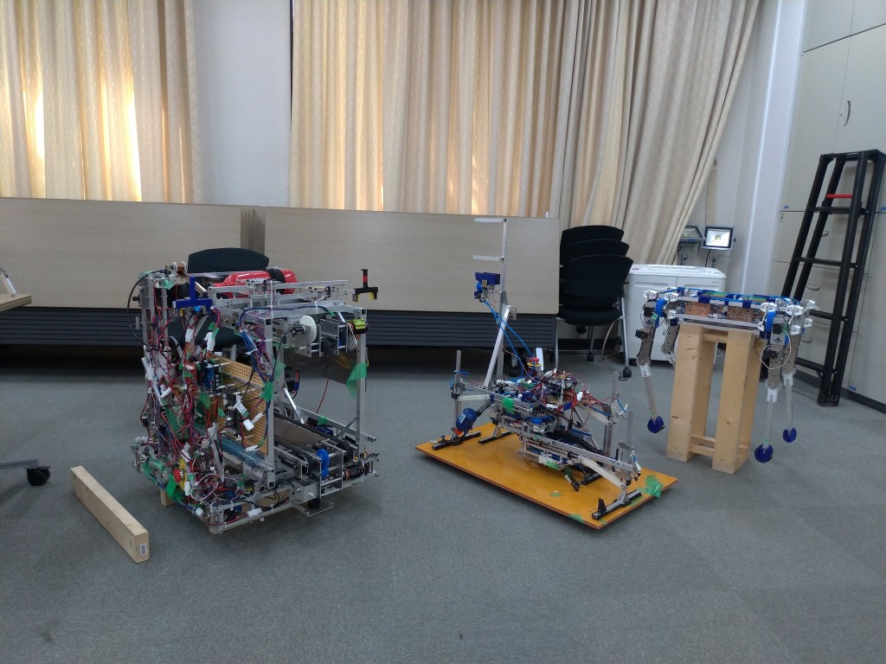

お久しぶりです,ソフト班3回のにーしゃです.  
8/9,10に京都工芸繊維大学のオープンキャンパスが行われ,ForteFibreも展示させていただきました.

２日両日ライントレーサ,ロボットハンド,UFOキャッチャー,パラレルリンクロボット,馬型ロボット,NHK学生ロボコン2019の出場機体を展示しました.

高校生はもちろん,大人から子供まで様々な人に来ていただき大盛況に終わりました.

興味を持ってくれた人も多く,ロボットのことも勉強のことも多くの質問をいただきました.是非将来の後輩になってもらいたいですね！

オープンキャンパスに来てくださった方もそうでない方も「ForteFibreに入りたい！」という方はメールでもtwitterでもどんどん連絡ください！いつでも待ってます！

