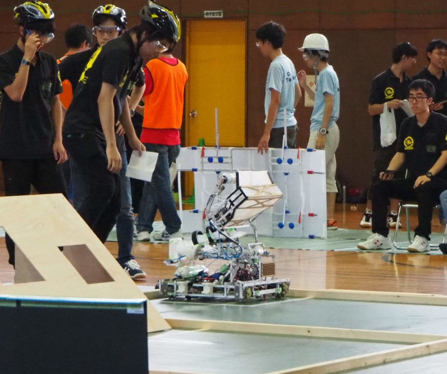
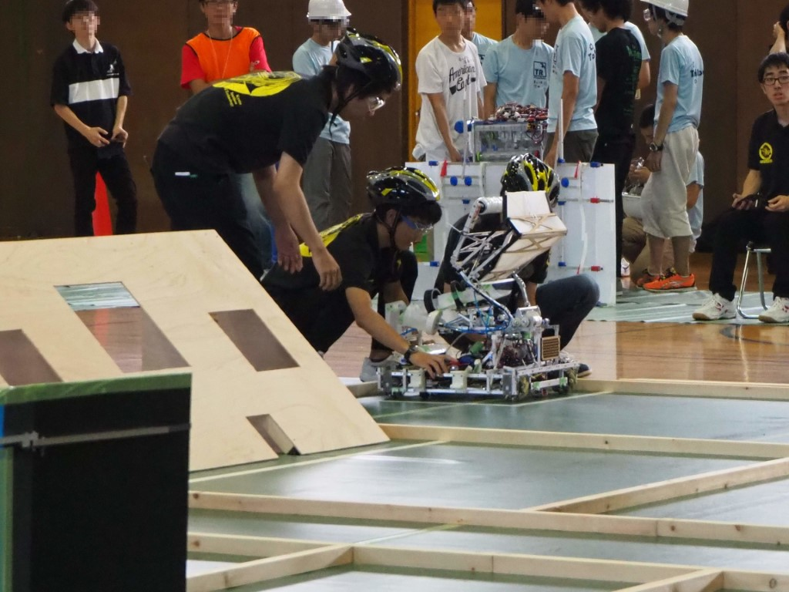
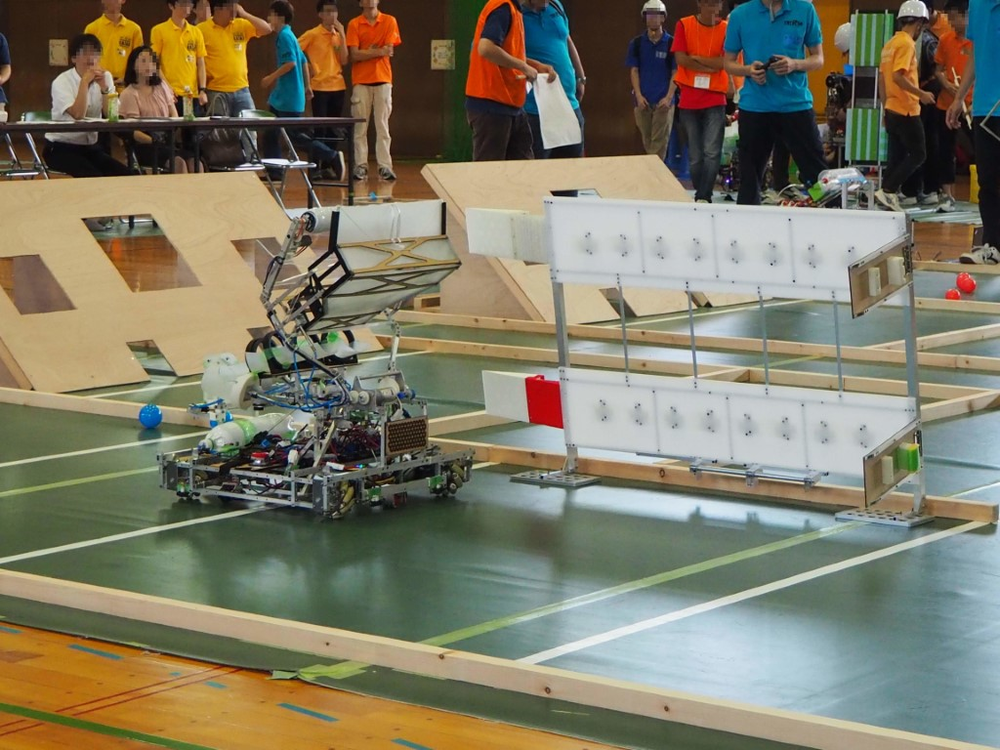

はじめまして。tinuと申します。先月8月31日に岐阜大学で行われたとうロボこと、東海地区交流ロボコン2019の大会の結果についてお話しします。

今回の大会の結果は,予選二回戦敗退でした。

今回のお題は「橋をかける機械」で、フィールド上にあるボールを集めた後、自ら制作した橋を用いて、所定のエリアに移動し、的にボールを入れて高得点を目指すというものでした。

敗因は一回戦中に起こった機体の故障が直らず,二回戦に突入してしまったからです。

テストラン時には、Vゴールできていただけに残念でした。

今回の我々の目標は,**「NHK学生ロボコンではできないことをする・NHK学生ロボコンに向けて何を注意すべきかを確認する」**というものでした。

今週はソフト班から、来週はハード班からお話しようと思います。

今回の大会に出場したことは、ソフト側から考えると

- 全自動で制御する人と途中まで手動で制御する人の2人制御者を用意すること
- プログラムがきちんと動くために意識すべきこと
- 大会当日に予想される事故をプログラムの観点から防ぐ方法
- 試合でより点数を稼ぐ戦略の組み方

を挑戦・再確認できたのは他では体験できない貴重なものになったと思います。

今回の大会を通して得られたものはとても大きなもので、次の大会に十分活かせるものになったと思います。

- 
    
- 
    
- 
