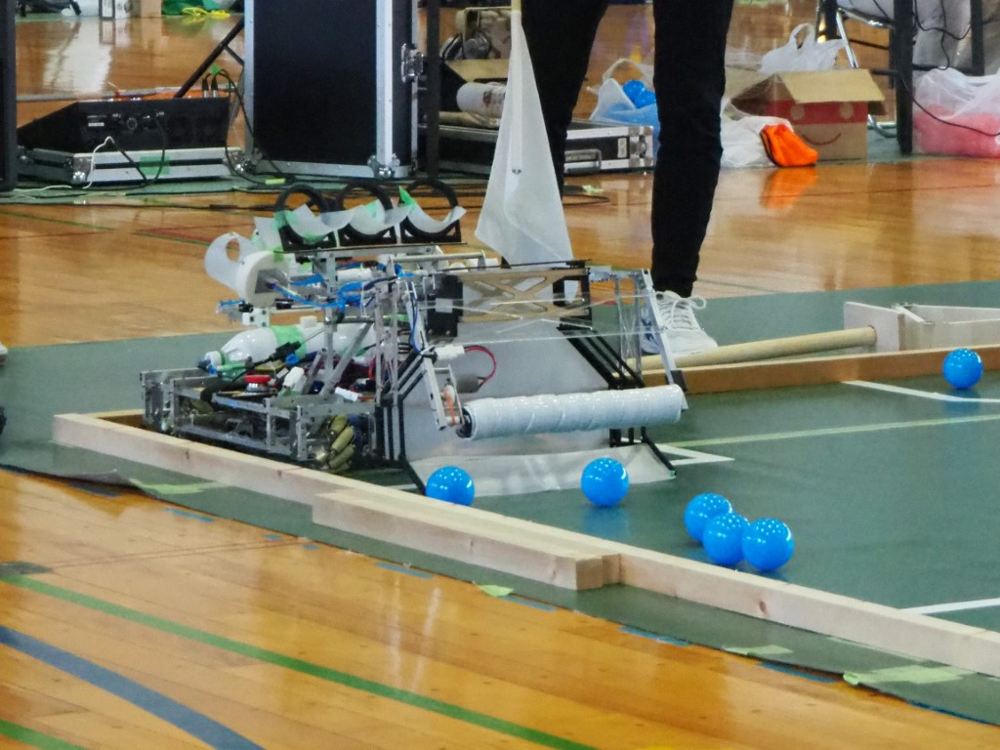
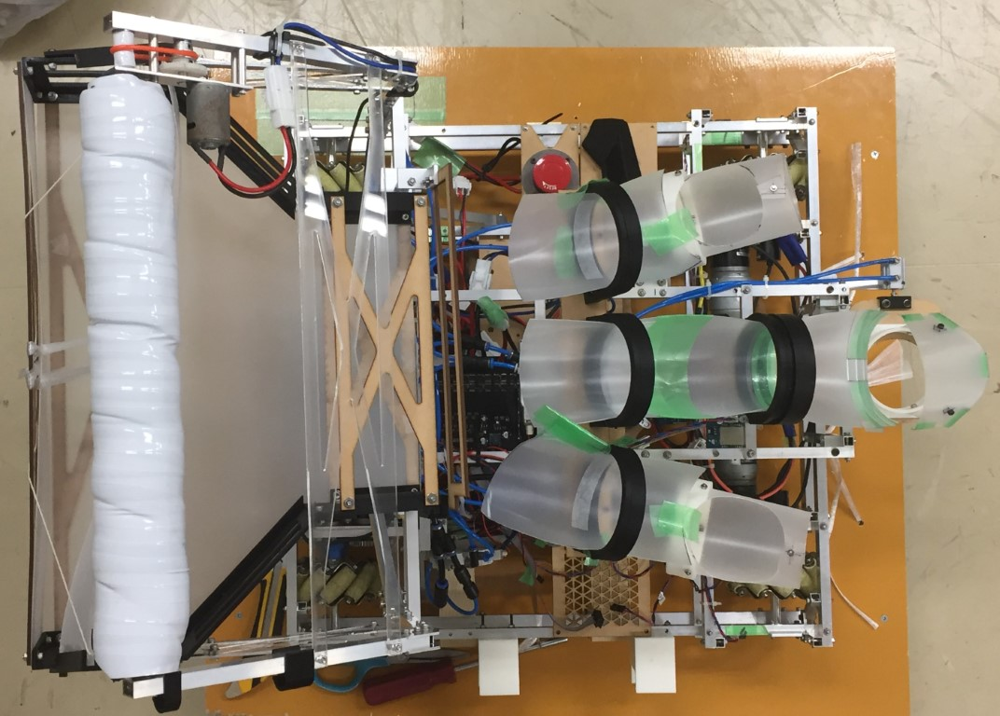

## はじめに

お久しぶりです。スライドレールです。

(この記事を書いているのは2019/09/20なのですが前回の私の投稿からちょうど1年経っていますね。スラレも1年分劣化しました。)

さて、前回の宣言通り今回はハード的な面からとうロボ2019について振り返りたいと思います。

## 機体紹介

我々の機体ですが、大会本番ではその性能を振るうことがなかったため今ここで少しだけ解説しておきます。

ボールはローラーの回転により巻き込むことで回収します。

この回収機構の根本にはモーターが取り付けられており、回収部ごと持ち上げることが可能です。

ルール上3種類の穴にボールを通さなくてはならないため、回収したボールを3つに仕分ける必要があります。

回収部に丁度ボールが3つ並ぶような窪みを付けておくことでその先の供給部に上手く分かれるように工夫しています。

どの得点機構もアクチュエータはエアシリンダーで左右に関しては射出、中央に関してはロックの解除で得点します。

橋はフィールド中央の木枠を越えて架けるとタイムの短縮につながると判断し、機体による体当たりで倒していました。

また橋にはスロープがついているため、足回りのフレームが干渉しないようにメカナムは少しだけ露出しています。

その他色々と工夫はされていますが基本的には上記のようなシンプルな機体構成となっています。

ちなみにですが、試合本番で破損したのは回収機構を上げるための歯車でした。

**機体展開の様子**

**機体上部からの様子**  

## あとがき

ここだけの話、最終的に出来上がった機体は初期案と全く異なったものとなっています。

大会ぎりぎりまで今まで実現しようと乗り出さなかった方法を採用した、橋を越える機体を作成していました。

設計したのは私ではないですが、これを実物として見ることができなかったのが少し残念なところです。

そのあたりのスケジュール調整を含め、今回は非常に学ぶことが多かった大会となりました。

今回は少し短いですが次の大会に向けて動き出していることもあり忙しいため、この辺りで失礼します。

同じ間隔で行くなら次に私が記事を書くのはさらに1年後になるかもしれませんね。

そういえば次の大会のコンセプトといえば...**オリンピックの競技種目**ともなっていますね？

またお会いしましょう。スライドレールでした。
