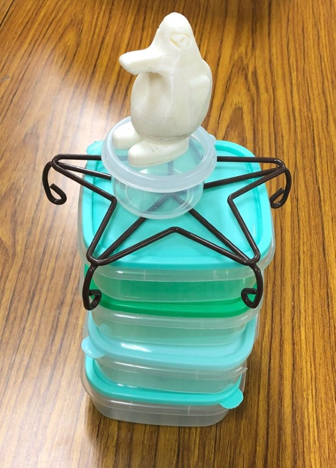
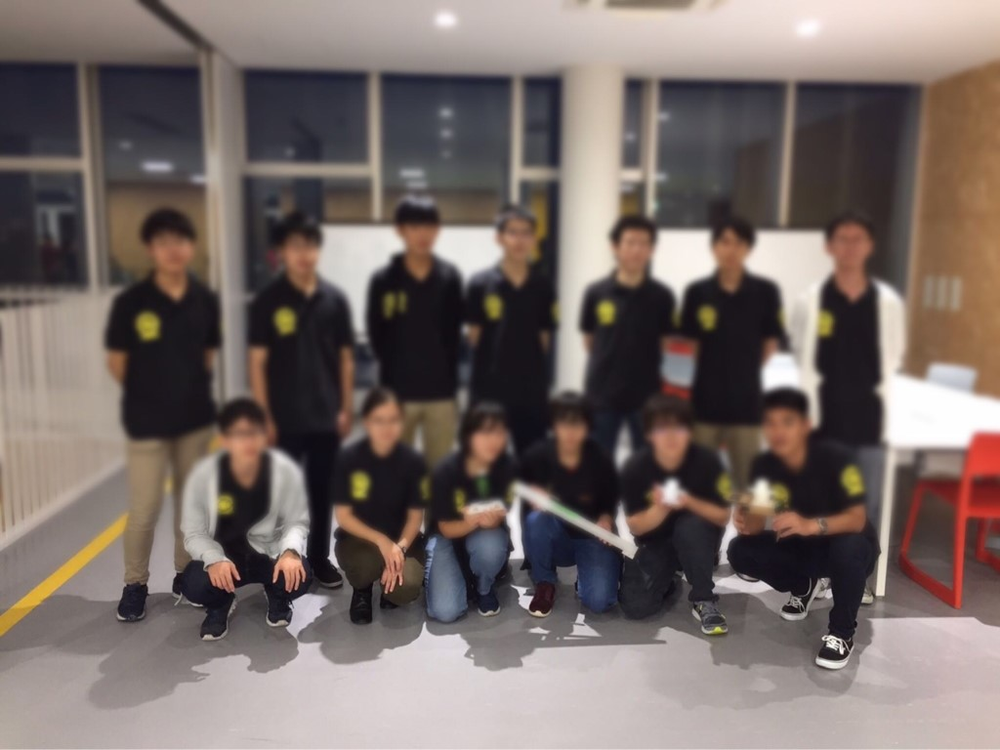

はじめまして、ソフト班1年のりーだるです。これからよろしくお願いします！

さて、去る9月22日に金沢工業大学さんで行われた新入生向けのロボコンであるSRC(Summer Robot Contest)に、弊プロジェクトから3チームが出場しました。

今年のルールは「建築」。  
四角いタッパーを4つと円柱のタッパーを一つ、星型の花台を縦に積み、その上に各チームがそれぞれ作成したシンボルを乗せることで'竣工'(Vゴール)達成となります。(下図参照)

  
全体としては竣工を達成するチームが多数存在するレベルの高い大会でした。

弊プロジェクトの結果は以下のとおりです。  
カティンギル　予選リーグ4位通過，決勝トーナメント一回戦敗退  
社畜候補生　予選リーグ6位通過，決勝トーナメント一回戦敗退  
ﾃﾞｰﾓﾝｺﾀﾞｯｸ　予選リーグ8位通過，決勝トーナメント一回戦敗退  
いずれのチームも力闘しましたが、無念にも決勝トーナメントで勝ち進むことは出来ませんでした。  
(新潟勢強かったです…)

大会後の交流会では普段あまり交流や情報共有の機会のない地域の大学の方々から、機体や各団体に関する様々な話を聞くことが出来、とても有意義な時間になりました。

大会直前には死んだ目をした一年生が大量発生していましたが、彼らはきっとこの経験を経て社畜のなんたるかを身につけて精神的に強くなったことでしょう。  
台風17号の接近により一時は大会の開催自体も危ぶまれていましたが、無事に開催されてホッとしました。(進捗が無に帰さなくてよかったです…)

一年生のみで行う初めての大会らしい大会だったのでわからないことも多く、探り探りで突っ走った約3ヶ月でしたが、今回の経験や反省を今後の大会にも活かしていきたいと思います。

我々の成長にご期待下さい！！！

次回からは各チームごとに焦点を当て出場した機体について紹介する予定です。(おそらく各チームの結果の詳細も語られる…はず…)  
お楽しみに！！
