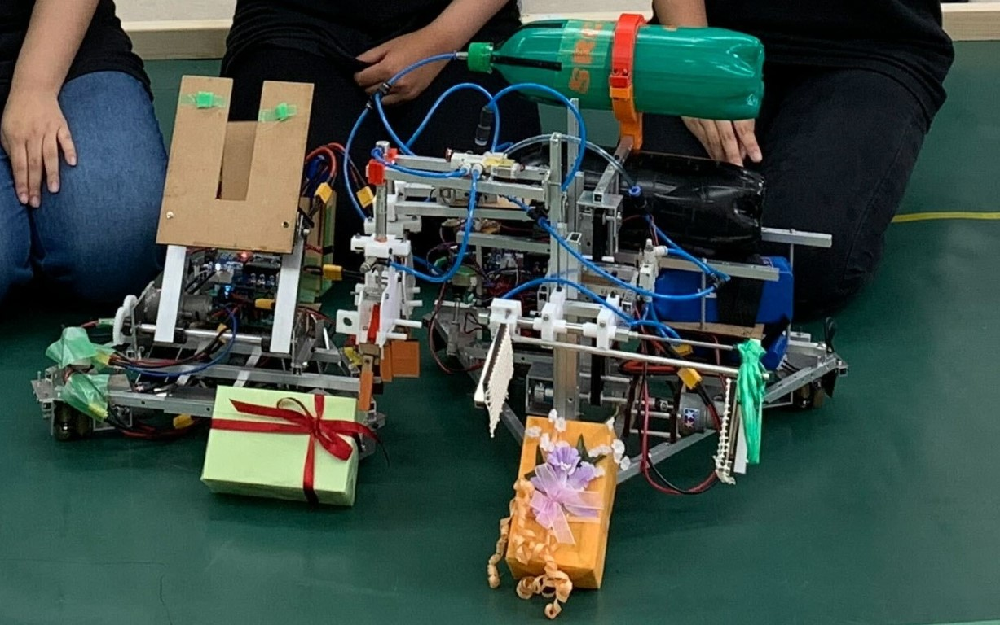
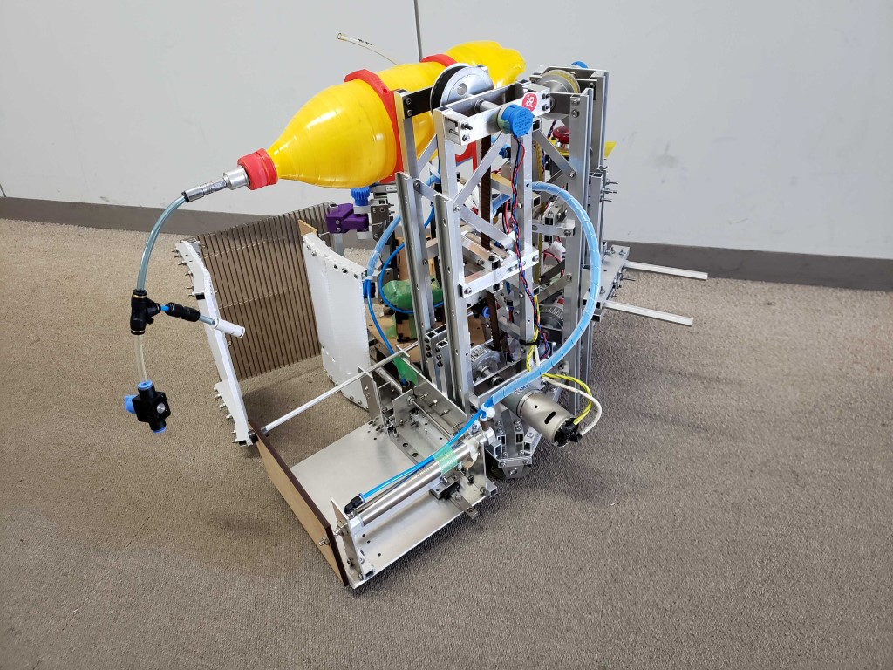
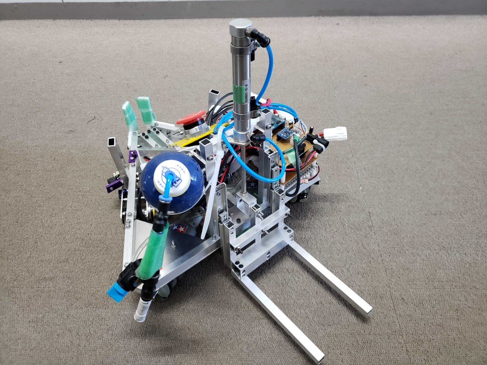
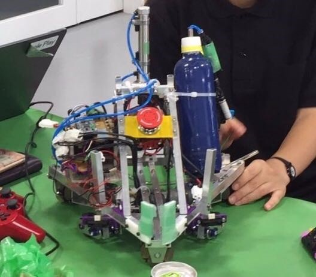

どうも、前回に引き続きりーだるです。  
じゃんけんで負けたので３週連続(予定)の機体紹介、トップバッターになりました。  
最初が基準になるので…とは言われますが、後になるほど何書けばいいかわかって来て記事が洗練されていくはずなので！と、ハードルをあげていきましょう。(プレッシャー与えていくのは大事ですからね！)

まえがきが長くなりましたが本題に入ります。  
まずは大会結果についてです。  
私達社畜候補生は以下のような結果に終わりました。  
予選リーグ１勝１敗　6位(8チーム中)  
　vs突撃ぽんぽん太郎(同志社大学) 50-20  
　vsLittle Busters!(金沢工業大学) 相手チームの竣工達成により敗北  
決勝トーナメント一回戦敗退  
　vsNAGAO・CART(長岡技術科学大学) 50-220  
初期段階における私達の目標が最速Vゴールであったことを考えるとかなり不甲斐ない結果となってしまいました。  
自動機はそれなりに動いていただけに,点数に関わってくる手動機が予定通りに動作しなかったことが悔やまれてなりません。

もう少しうちの機体を見てほしかった…ということで！

ここからは動く姿をあまりお見せすることが出来なかった機体たちについて説明していきます！

これらがうちの機体です！！！ﾃﾞﾃﾞﾄﾞﾝ!!  

いやー可愛い。実に可愛いですねうちのこたち！  
目に入れてもなんとやらってこういうことなのか、とこの歳で思うことになるとは考えていませんでした。  
え、なんか機体じゃないやろお前、みたいなやつがいる？まぁ気のせいです(ｷｯﾊﾟﾘ)

＝＝＝＝＝＝＝＝＝＝＝＝＝＝＝＝＝＝＝＝＝＝＝＝＝＝＝＝

まずは手動機についてです。  
制御と操縦を僕が担当しました。  
大会数日前に機体が上がって、なんも考えずに動かし始めた結果ベイブレードさせてしまったことから名前が【ぐるぐる摩天楼】になってしまいました。

手動機は大まかに分けて3つの機構を搭載しています。  
タッパーを機体内で保持するためのタワー部分、おいてあるタッパーを拾い・持ち上げ・タワーに押し込むステージ部分、シンボルと梁(星型の花台)を持ち上げる爪部分の3つです。  
ステージはフィールド上においてあるタッパーをエアシリンダーで掻き込み、タイミングベルトを用いステージ自体を上下させ、タワーの中にエアシリンダーで押し込みます。ステージの安定した動作のためにガイドレールを用いたり、ステージ自体がかなり重いため剛性を上げるためにトラスをくんだりと、基本的ではありますが機構を考えるときに重要なことがかなり盛り込まれた機体になったのではないでしょうか。(ほんまか)  
ワークを取る順番は予め決めていたのでポテンショメータを用いてステージの高さを自動で変えられるようにはしていたのですが、パラメーター調整がまにあわず安定性に欠けていたので本番では使うことなく手動で高さを合わせていました。  
タワーはタッパーを機体内で保持するためにほぼぴったりタッパーがはまるサイズで設計されています。エアシリンダーでタワー自体を開閉することで、中で積み上げたタッパーを機体自体を後方に下げるだけで建築エリアにおける想定でした。  
本番ではこのタワーの調整がうまく行っておらず、タワー自体が開かなかったり、積んだタッパーが移動中に崩れるような事態に陥ってしまいました。  
爪の部分はなかなか案がまとまらず完成が最後であったため、上下する機構にはほぼステージと同様の設計思想を用いています。ステージよりも機構が軽いためか挙動が安定していたので、僕はこの部分が一番好きです。ちなみに愛が溢れた結果この機構にのみエリザベスという名前がついています。  
このようにいろいろなものを剛性マシマシで積み込んだ結果めちゃくちゃ重くなりました。(ほぼ制限重量)  
他のチームの人が軽々と機体を持っているところを見るとダイエットさせてあげるべきだったかなとも思いますが、自分たちのアイデアを積み込んだ機体を具現化しちゃんと動かすことが出来たのは自分たちにとって大きな経験になったと思います。  
＝＝＝＝＝＝＝＝＝＝＝＝＝＝＝＝＝＝＝＝＝＝＝＝＝＝＝＝  
続いて自動機についてです。  
自動機タスク自体が人の手で搭載された2つのものを運び、おいて戻るというものだったので、その用途のみに最適化した最低限のものを積むように心がけました。このため手動機と比べたらかなりシンプルな機構が組まれています。

設計者のこだわりポイントは上下機構を安定させるためのスライドレール。エアシリンダーへの負担を減らすのはもちろんですが、やはり滑らかに動くので安定感がありますね！  
ちなみに僕のこの機体の推しは、エアシリンダーの固定を安定させるためのトラスを有効活用し斜めに取り付けられた緊急停止スイッチです。(押しやすい！)  
ところでこの自動機、ラインセンサ・測距センサ・ジャイロセンサ・エンコーダの４つのセンサー類を搭載していたのですが、実際にはジャイロセンサとエンコーダーしか使っていません。(見かけ倒し!?)  
ジャイロを用いてyaw軸を、2つのエンコーダーを用いてx,y軸の自己位置を取得しています。

取得したx,y軸の自己位置から目標座標に収束するように軌道を修正し、機体が回転しないようにyaw軸方向に補正をかけるようなプログラムを組んでいました。

  
自動機に関しては本番でも安定した挙動を見せ、確実にタスクをこなしてくれました。  
制御者は色々試行錯誤しており、大会2日前まで機体が想定した動きをしてくれなかったため不安もありましたが無事動いてくれて安心しました。

ということで、以上が私達の機体紹介になります。  
ここまで読んでいただきありがとうございました。  
これを読んだあなたももう社畜候補生の一員ですね！(ほんまか)  
みなさんも立派な社畜を目指していきましょう…！

次回はカディンギルのチーム紹介です。お楽しみに！
