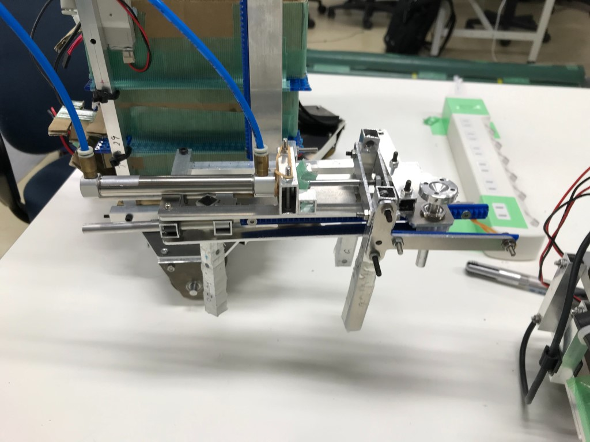

どうも，一回生ソフト班のchapatiです．りーだるが書いてくれた[この記事](https://www.fortefibre.net/blog/?p=3807)と[あの記事](https://www.fortefibre.net/blog/?p=3819)に続き，チームカディンギルの紹介と機体のお披露目の方をさせていただきます．何やら記事のクォリティについてハードルを上げてくれたようですが，その下を堂々とくぐっていこうかと思います．

* * *

まずはSRCの戦績ですが，

- 予選
    - vs 新潟大学 無印不良品　40 対 70 で負け
    - vs 長岡技術科学大学 NAGAO・CART　90 対 280 で負け
- 決勝
    - vs 新潟大学 無印不良品　一回戦敗退

というようなあまり芳しくない結果でした．今振り返れば数々の改善点が露呈するあたり，詰めが甘かったと痛感する次第です．

* * *

次に機体の紹介です．

**手動機**  

手動機全体  

今回の大会では複数種類のオブジェクトを積み上げることが目的となっているため，オブジェクトの形状に応じて2種類の機構を使い分ける構成としました．

積み上げるもののうち，タッパという直方体に近似するオブジェクトがあるのですが，こちらは画像右側の四角い機構の中で縦に積み上げ，フィールド上の所定の位置に設置します．タッパ以外のオブジェクト(梁，柱，シンボル)はそれぞれ形状が異なるので画像左側に見えるアームで一つ一つ持ち上げ，所定の位置に持っていき，タッパの塔の上へ積み上げます．

一見するとシンプルに見えるこれらの機構ですが，特にタッパを保持する機構は設計者がなかなかの趣向を凝らしており，製作に非常に時間がかかるというトレードオフはあったものの，カッコイイ動きをします．初めてその動きを見たときは非常に感動しました．

タッパを保持する機構の正面図

アーム．滑り止めとしてシリコンがついている

ただ，やはり製作に時間がかかるというのはかなり大きな代償で，コントローラを用いた機構全体の制御に大会前日の1日しか割けなかったのはなかなか痛い点ではありました．

* * *

**自動機**

自動機全体

手動機が積み上げるオブジェクトのうち，梁とシンボルは最初に自動機が所定の位置まで運搬する必要があります．その際，シンボルは穴のあいたブロックに載せるので，フォークリフトのようなアームを機体に搭載することにしました．自動機の全体図を見る限り，そのフォークリフトのようなアームをどうやって使うのかがわからないかもしれませんが，以下の画像のように展開します．これまた動いてる様子がカッコイイのです．

展開した自動機のアーム  

自動機のタスクは比較的単純で，上部機構が無くとも足回りさえあれば制御の殆どの部分はできてしまうほどだったので，こちらは特に機体の完成を待つ必要はなかった反面，いくつかトラブルがありました．

例えば，当初はラインセンサを搭載し，ジャイロの補助としてフィールド上のラインを読むようにするつもりでしたが，移動した距離を知るためのエンコーダと物理的に干渉してしまうことが機体の完成後に判明し，当初の予定の変更を迫られました．結果として使わずになんとかなったのは幸福でした．

また，FAQの更新の確認を怠っていたために，大会前日の練習用フィールドの撤収後に，制御を大幅に変更しなければならないことが判明し，なおかつ気づいたときには夜遅かったこともあり，翌日の行きの電車の中で急いでプログラムを修正しなければなりませんでした．ただ，プログラムの設計をしっかりしていたこともあり，修正にさほど時間はとられず，試合中もしっかりタスクをこなすことができていました．

* * *

大会に出場するにあたり様々な問題点と格闘することになりましたが，その点も含めて非常に勉強になった良い機会でした．今回の経験を基に，次回出場する大会では良い成績が出せるよう研鑽していこうと思います．最後までお読みいただき，ありがとうございました．

次回は最後のチーム，デーモンコダックの紹介です．彼らならきっと面白い記事を書いてくれることでしょう．お楽しみに．
