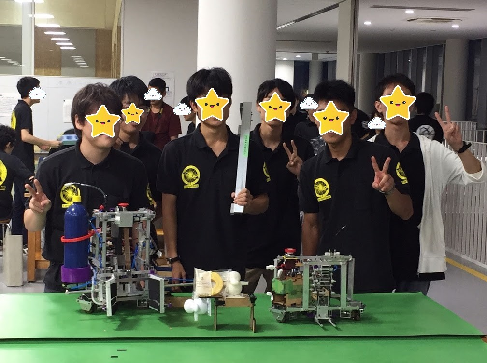
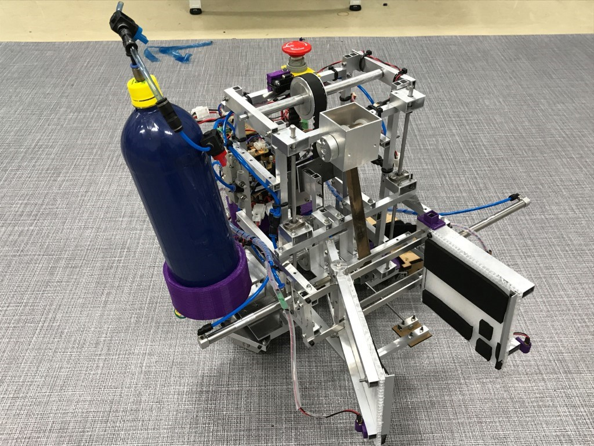
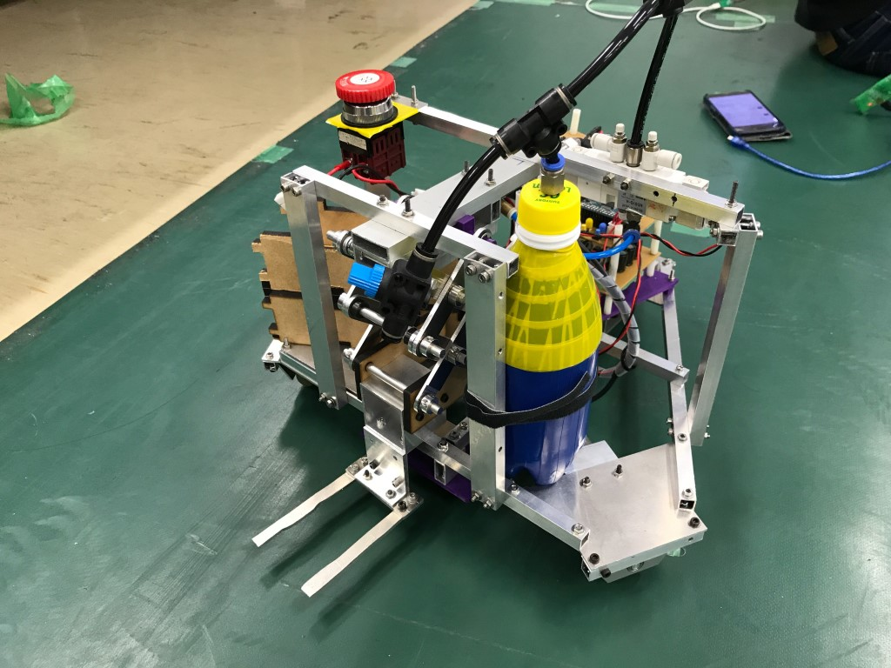
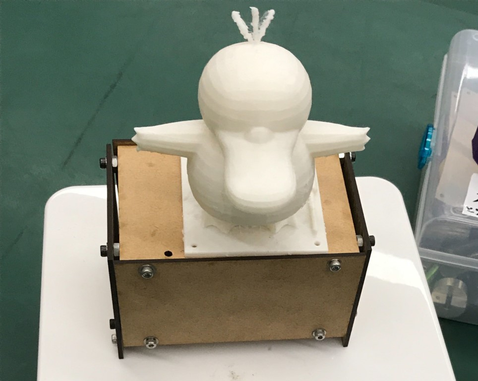

##   

全国のロボット好きのみなさん、お疲れ様です。1回生ハード班のhachiです。

僕たちのチームﾃﾞｰﾓﾝｺﾀﾞｯｸが9月22日のSRC2019に参戦しましたので結果を報告させていただきます。（遅くなりすいません）

（SRC2019で「デーモンコダック」というように全角で扱われてしまったのですが、我々は半角にこだわります。）

## ﾃﾞｰﾓﾝｺﾀﾞｯｸの戦績

・**予選リーグ**

　ﾃﾞｰﾓﾝｺﾀﾞｯｸVS ラ　

　一回目　20点　対　2分10秒で竣工　　敗北！次！

　二回目　60点　対　120点　　　　　　 敗北！まだ舞える！

　8チーム中8位通過（よく言えばベスト8!）

・**決勝トーナメント**

　　ﾃﾞｰﾓﾝｺﾀﾞｯｸVS Little Busters!　Little Busters!の竣工で敗北　　ｺﾀﾞｯｯｯ

　一回戦敗退（控えめな結果）

結果は良くありませんでしたが、今回の反省点をふまえて次の大会に向けて頑張っています。

ﾃﾞｰﾓﾝｺﾀﾞｯｸにくよくよしている時間はない！頑張れ！ﾃﾞｰﾓﾝｺﾀﾞｯｸ！

次にﾃﾞｰﾓﾝｺﾀﾞｯｸの機体を紹介したいと思います。

## **手動機の紹介**

**ハンド機構（ちなみに僕の担当です）**

一方のハンドはつかむ面を押し出すような動きに、もう一方はハンドの位置は固定で適当な角度内を回転するように設計することにより、正方形のタッパーをつかむだけでなく、 星形の置物(以下梁)をつかめるようにしました。

**ハンド昇降機構**

ハンドでつかんだオブジェクトを積み上げるための機構です。

ハンドがタッパー4つ分より上に上がらないという事件が発生（これはこれでいい経験や、たぶん）

**回転機構**

裏返っているタッパーをひっくり返すための機構です。

最初はタッパーをボックスの中に入れそれごと回転させてひっくり返すという案だったんですが、サイズ規定に引っかかり泣く泣く没案になり、タッパーを落としタッパーの端に棒をぶつけひっくり返す案になりました。

 運任せのように思えるんですが高確率で成功しました。これでええんかいっていう感じになりました。

プログラム

コマンドがいっぱいあったり、機体が光ったり、コントローラーが振動したり、楽しそうだった。ちゃんと動くプログラムでした。ソフト班すごいなあ。

## 自動機の紹介

ハンド

マジックハンド方式でフォークリフトを持ち上げます。意識高い系やん。

プログラム

制御の方法に関してはエンコーダーのみによる制御でした。エンコーダーのすべりやパラメーターの調整が大変でした。

## シンボル

ﾃﾞｰﾓﾝｺﾀﾞｯｸとその右足のそばにあるマイナスドライバーのセットは3Dプリンターで作りました。かわいい。

これで機体紹介を終わります。

この大会を終えて反省点はたくさんありましたが、それを次につなげたいと思います。次の大会の関西春ロボでは必ず勝つ！

最後までお読みいただきありがとうございました。

ﾃﾞｰﾓﾝｺﾀﾞｯｸも喜んでます。
