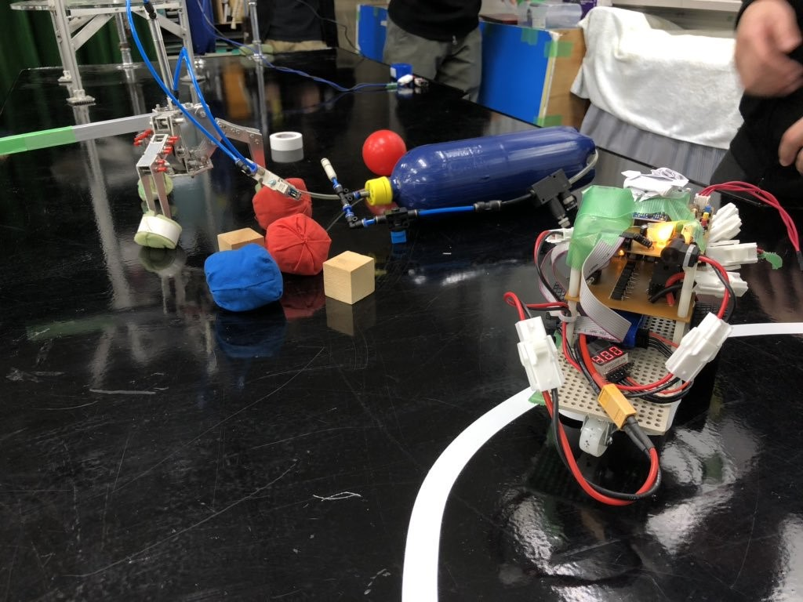
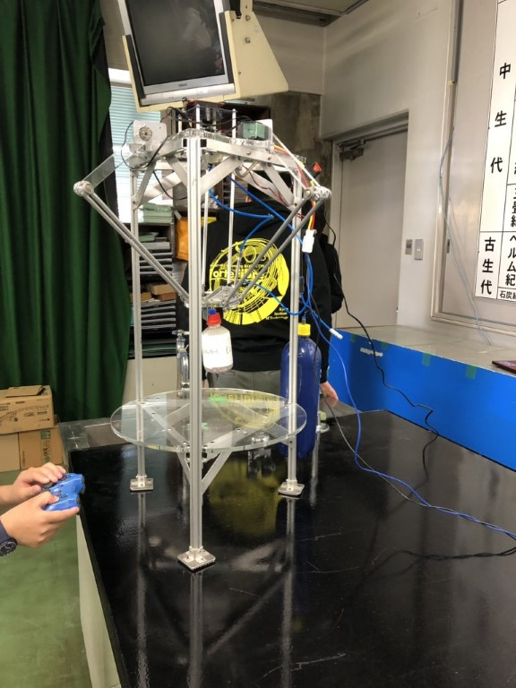

お久しぶりです.ソフト班3年のにーしゃです.  
ブログを書くのはオープンキャンパスぶりですね.  
世間ではクリスマスが騒がれていますが,僕は寒いと噂の松ヶ崎の冬の訪れに悲しみを覚えながら課題に追われております.

さて,去る11/9,10両日「青少年のための科学の祭典　京都大会」(以下：科学の祭典)に出展させていただきました.

ForteFibreの広報活動として[ロボットサミット](https://www.fortefibre.net/blog/?p=3553)と並び毎年出展させて頂いております.

具体的な出展物は以下の通りです.  

- ライントレーサ
- ロボットハンド
- パラレルリンクによるUFOキャッチャー

おなじみのロボット達なのでForteFibreの広報イベントに来てくださったことがある方ならご存知かもしれませんね.  
UFOキャッチャーは操縦,ロボットハンドでは積み木を積んでもらい「実際に体験できるブース」を目指しました.

どうやってロボットが動いているのかを知ってもらい,そして実際に体験してもらうことで少しでもロボコンに興味を持ってもらえたら嬉しいですね.  
あわよくば将来ForteFibreに入部してほしいですね

実際にロボットを作ってみたい！動かしてみたい！という方がいればオープンキャンパスなどでも出展しているので是非ForteFibreを訪れてみてください！

