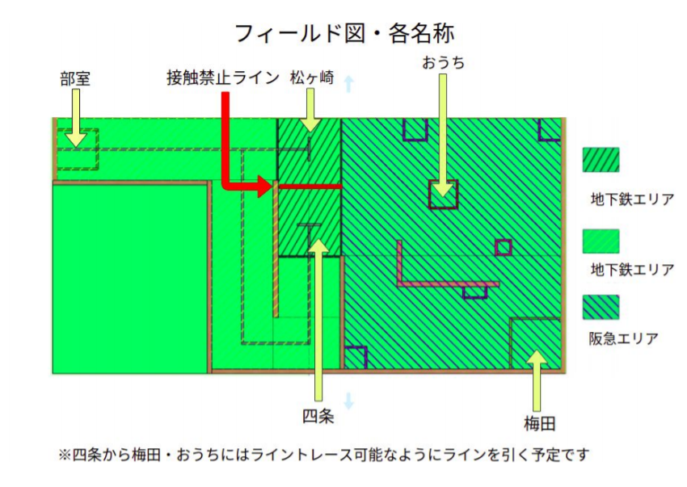
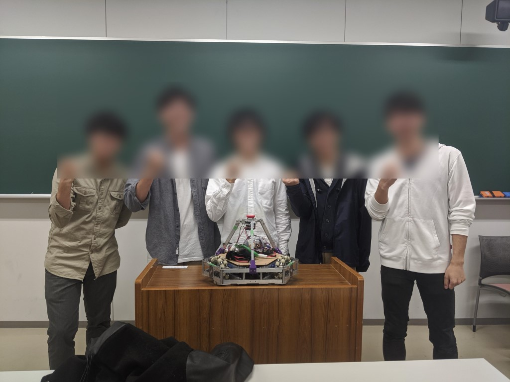

制御練習ブログ担当になりました、一年の制御練習参加者のイーストです。

今回は、１０/１８に行われました 制御練習について書きます。

～ルール説明～

今回のテーマは帰宅おたくです。

部室から、松ヶ崎、四条、梅田と定められたフィールド上のポイントを通り、おうちにできるだけ近くで止まることが目標です。　　　　　　　　　　　

大会全体で、目標を達成できたのは一人のみでした。他の参加者は停止地点で機体が停止できなかったり、停止した後も接触禁止エリアに当たったり、かなり苦戦していました。帰宅できた人の機体はかなりスムーズに動いていたため、帰宅途中の動きにも歓声があがり、達成した時には大きな拍手が起こっていました。

今回は部内の大会ではありましたが、 公式大会と同様に機体の調整はかなり大変で、大会前の二日間はとても調整に苦労しました。しかし、制御練習に出場された先輩が使用していた技術はとても魅力でした。また、一年の参加者二人もそれぞれ新しいことに挑戦できたので、とても有意義な大会になりました。今回かなりいろいろなことが経験できたので、今後の大会で生かしていきたいです。
