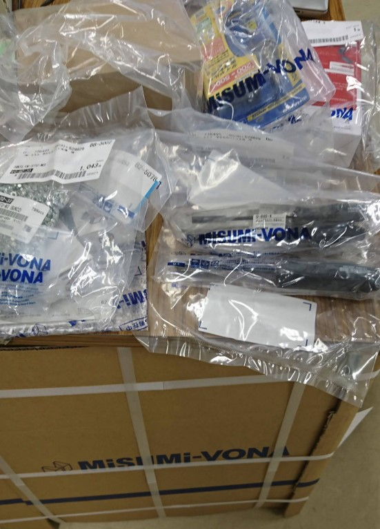
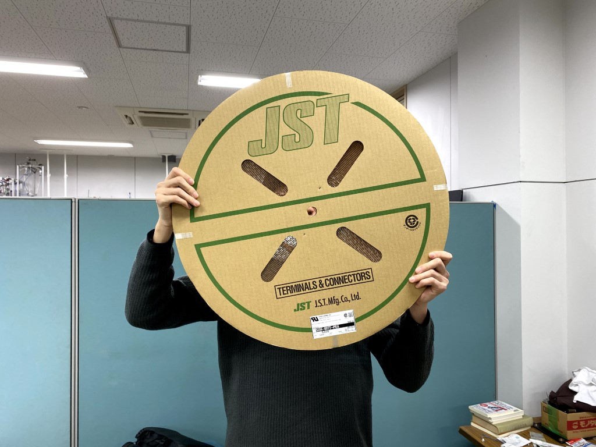

新型コロナウイルスが猛威を振るい、多くのイベントやコンサート、夢の国などが中止や臨時休園になっていますが、学生ロボコン、ABUロボコンが中止にならないように、ウイルスの収束を祈るばかりです。

こんにちは、きくのはなです。今回でブログを書くのは二回目になります。

先日、[株式会社ミスミ様](https://www.misumi.co.jp/)が毎年企画されている、「ミスミ学生ものづくり支援 」で5万円分の支援部品を頂きましたので、ご報告させていただきます。

今回の支援で頂いたものは、ナイロンナット、ナットドライバー、エンドミル、はんだごて一式、デジタルマルチメーターなどといった、ロボコン活動をする上で重要なものばかり、そして今回の目玉（？）が以下の画像の品です。

**でかい、とにかくでかいです。**なんだこれは？と疑問に思うひともいることでしょう。これはXHコネクタ作成に必要な[XHコンタクト](https://jp.misumi-ec.com/vona2/detail/222000498883/?HissuCode=SXH-001T-P0.6&PNSearch=SXH-001T-P0.6&KWSearch=SXH-001T-P0.6&searchFlow=results2products)で、この円盤の中に8,000個入っています。この個数があれば、少なくとも５年間は在庫に困ることは無いでしょう。学生支援をしていただいた株式会社ミスミ様に感謝です。

それではまたいずれ。
